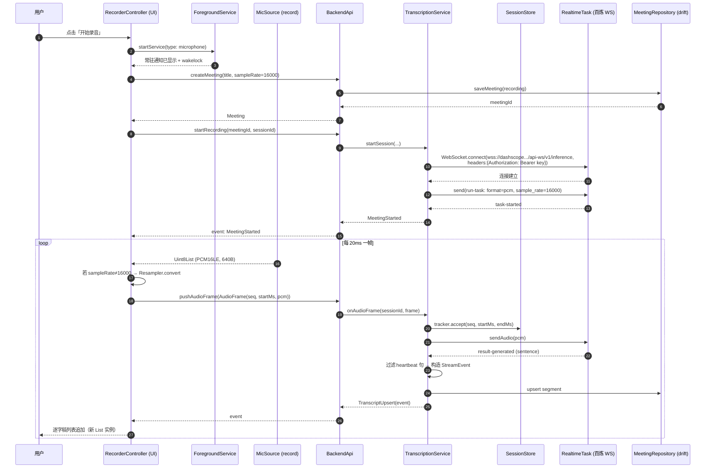
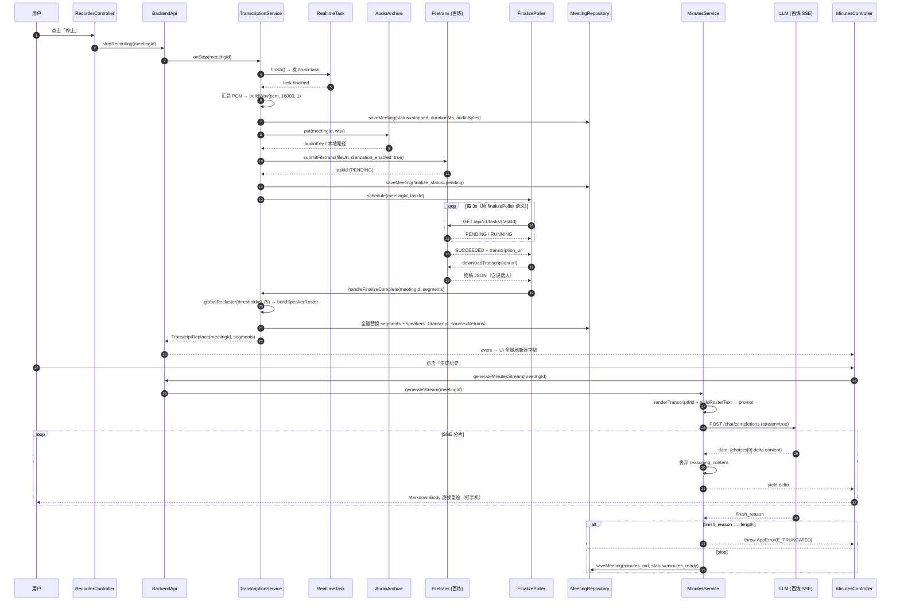
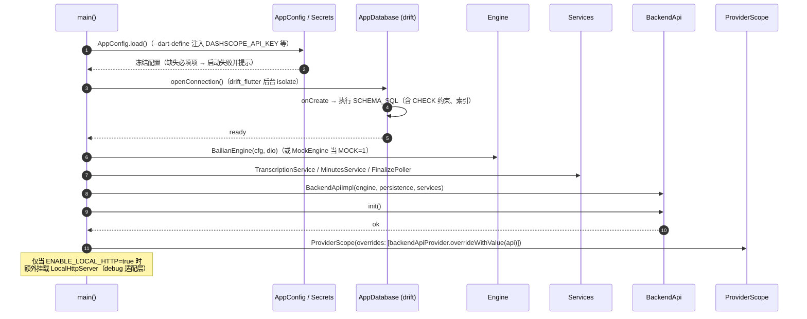
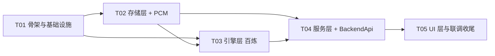

# 智能会议纪要 · Flutter 移动端架构设计（方案 B）

> 文档版本：v1 · 撰写：架构师 高见远 · 日期：2026-09-24
> 项目路径：`/Users/sumuzhi/WorkBuddy/2026-09-23-15-22-01/smart-minutes-flutter`（全新独立项目）
> 参考基线：`/Users/sumuzhi/WorkBuddy/2026-09-23-15-22-01/smart-minutes` @ `b741794`（**只读参考，本次零改动**）

---

## 0. 前置声明

### 0.1 铁律遵守情况

| 铁律 | 状态 | 校验方式 |
| --- | --- | --- |
| 不修改原项目任何文件 | ✅ 已遵守 | 开工前 `git rev-parse --short HEAD` = `b741794`；`git status --porcelain` 仅有他人新增的未跟踪文档（`docs/FRONTEND-UI-OPTIMIZATION-DESIGN.md`、`docs/MOBILE-BACKGROUND-RECORDING-SPEC.md`、`docs/PRD-UI-OPTIMIZATION.md`、`docs/mobile-history-fixed.png`），**非本次产生** |
| 复用方式 = Copy / Dart 重新实现 | ✅ 已遵守 | 本文所有"移植"均指在新项目内用 Dart 重写，不抽取公共包、不改原项目导出 |
| 新项目独立目录与依赖 | ✅ 已遵守 | `smart-minutes-flutter/` 独立 `pubspec.yaml`、`android/`、`lib/` |

### 0.2 本文的证据规则

- 所有第三方包的**版本号、维护状态、平台矩阵**均来自本次 WebSearch 实查，每条附来源链接。
- 查不到权威来源的条目一律标注 **【不确定】**，并进入 §9 待验证清单，**不猜测**。
- 原项目契约（REST 路由、WS 帧格式、百炼协议、SQLite schema）均来自原项目源码实读，行号可回溯。

### 0.3 已确定的用户约束（沿用上一轮结论）

| 约束 | 取值 | 对本文的影响 |
| --- | --- | --- |
| 分发方式 | 自用侧载 | 商店审核不适用；可用非常规权限（前台服务、明文 localhost、锁屏录音） |
| 目标平台 | **仅 Android** | iOS 相关配置全部省略；无 JIT/内嵌解释器限制 |
| API Key | 可随包分发 | 无中转服务；密钥从 `--dart-define` 或本地加密配置注入 |

---

## 1. 目标与范围

### 1.1 目标

在**单台 Android 手机、无任何自建服务器**的前提下，复刻原项目全部在线能力：

1. 16kHz/16bit/单声道 PCM 采集 → 实时转写（边说边出字）
2. 停止录音 → 会后终稿转写（含说话人分离）→ 全量替换逐字稿
3. 纪要流式生成（打字机效果）+ Markdown 展示 + 复制/导出
4. 会议 CRUD、历史列表、详情、录音回放与跳播
5. 音频归档（本地为主，COS 可选）

### 1.2 不在范围

- **知识库（KB）已下线**：不实现 `/kb/reindex`、`/kb/query`、`kb_index` 表、`kbService.js`、`retrieve.js`、`knowledge-extract.md`
- iOS / Web / 桌面端
- 多用户、鉴权、同步
- 具体视觉样式（ardot 设计稿暂不可读，见 §7 待明确事项 Q1）

### 1.3 原项目规模（复刻工作量基线）

| 侧 | 文件数 | 行数 | 说明 |
| --- | --- | --- | --- |
| `server/src` | 25 | ~7,196 | REST + WS + 百炼 3 条链路 + 持久化 + VAD/聚类 |
| `web/src` | 34 | ~7,178 | 页面 4、组件 13、hooks 7、audio 6 |
| `server/test` | 11 | 166 条 `test()` | **复刻时最有价值的资产：契约与算法的黄金样本** |

---

## 2. 技术选型与理由

### 2.0 决策摘要表

| 领域 | 选型 | 版本 | 关键理由（一句话） |
| --- | --- | --- | --- |
| 运行时 | Flutter / Dart | **3.47.5 / 3.13.4**（stable，2026-09-17，已就绪） | 单进程内同时承载 UI 与后端逻辑，无内嵌解释器 |
| 音频采集 | **`record`** | `^7.1.1` | Android 支持 `pcm16bits` **流模式**，可指定 `sampleRate`、`numChannels` |
| 本地持久化 | **`drift` + `drift_flutter` + `sqlite3`** | `^2.34.3` / `^0.3.0` / `^3.5.2` | 类型安全 + 反应式流 + 后台 isolate；**不要**再引 `sqlite3_flutter_libs`（已 EOL） |
| 本地服务端形态 | **② 进程内类型化 API**（+ debug-only ① HTTP/WS 适配层） | — | 见 §2.4 论证 |
| HTTP 客户端 | **`dio`** | `^5.11.0` | SSE 流、拦截器、超时与取消能力；`http` 无原生流式分片 |
| 状态管理 | **`flutter_riverpod`** | `^3.4.3` | 维护活跃（2026-09-04 发布）、`AsyncValue` 天然适配流式/异步 |
| 路由 | **`go_router`** | `^17.5.0` | flutter.dev 官方；17.3.0 起要求 Flutter ≥3.38/Dart ≥3.10，本机满足 |
| Markdown 渲染 | **`flutter_markdown_plus`** | `^1.0.12` | 原 `flutter_markdown` **已于 2025-02 停止维护**，官方指定替代即本包 |
| 音频回放 | `just_audio` | `^0.9.42` | 本地文件播放 + seek，用于录音回放跳播 |
| 权限 | `permission_handler` | `^13.0.0` | Android 13+ 通知权限、麦克风权限、电池优化豁免引导 |
| 后台保活 | `flutter_foreground_task` | `^9.2.2` | `foregroundServiceType="microphone"` + 常驻通知 + wakelock |
| 对象存储（可选） | `tencentcloud_cos_sdk_plugin` | `1.4.0`（建议**锁定小版本**） | 官方 Flutter 桥接 SDK；建议改用 `_nobeacon` 变体 |

---

### 2.1 运行时：Flutter 3.47.5 / Dart 3.13.4

**实查结果**（`flutter --version`，本次执行）：

```
Flutter 3.47.5 • channel stable
Framework • revision 6a19cca564 (6 days ago) • 2026-09-17
Tools • Dart 3.13.4 • DevTools 2.60.0
```

- 已装于 `/Users/sumuzhi/.workbuddy/binaries/flutter/flutter`，**当前可用**，设计不必等待。
- 旁证：pub.dev 的 pana 分析页显示 `Analyzed with Pana 0.23.19, Flutter 3.47.0, Dart 3.13.0`（[drift_flutter/score](https://pub.dev/packages/drift_flutter/score)），与该版本号区间一致。
- **Dart 3.13** 意味着：`records`、`sealed class`、`patterns`、`dart:io` 的 `WebSocket`/`HttpServer` 全部可用；`Isolate.spawn` + `SendPort` 可用。

**为什么不再需要"内嵌 Node"**：原方案的内嵌 Node 只是为了让 7196 行 JS 后端能在手机上跑。方案 B 把后端用 Dart 重写后，**同一进程内既是前端也是后端**，彻底消除了跨运行时、跨进程、跨 ABI 的全部问题。这是方案 B 相对方案 A 的根本收益。

---

### 2.2 音频采集：能否拿到 16kHz / 16bit / mono PCM 流？

#### 候选对照

| 包 | 最近版本 | Android PCM 流 | 指定采样率 | 维护状态 | 结论 |
| --- | --- | --- | --- | --- | --- |
| **`record`** | `7.1.1`（11 天前发布） | ✅ `pcm16bits` Stream | ✅ `RecordConfig.sampleRate` | Good（160 pub points，879 likes，718k 下载） | **选它** |
| `flutter_sound` | 9.x | ✅（`openRecorder` + `startRecorder(codec: pcm16)`，走 `StreamController` 的 `FoodData`） | ✅ | Good | 备选，API 更重、文档散 |
| `mic_stream` | — | 有限 | 【不确定】 | 较弱 | 不选 |

`record` 官方平台矩阵（[pub.dev/packages/record](https://pub.dev/packages/record/install)，v6/v7 README 摘录）：

- **Stream 表**：`pcm16bits` 在 Android / iOS / web / Windows / macOS / linux **全部 ✔️**
- README 明确："wav and pcm16bits are provided by the package directly"（不依赖 MediaRecorder 编码能力）
- File 表注脚："wav / flac：`Unsupported on legacy Android recorder`"→ 需 `AndroidRecordConfig(useLegacy: false)`
- Android 侧 v5+ 使用 `AudioRecord` + `MediaCodec`（legacy 模式用 `MediaRecorder`）
- 平台支持：`numChannels` ✔️、自动增益 ✔️、回声消除 ✔️、蓝牙 SCO 自动、设备选择 ✔️

#### 关键风险：Android 是否真的给 16000Hz？

- Android 官方文档对 `AudioRecord` 的说法是：**44100Hz 是唯一全设备保证的采样率**，22050/16000/11025 "may work on some devices"（[developer.android.com/reference/android/media/AudioRecord](https://developer.android.com/reference/android/media/AudioRecord.html)）。
- 但现代 Android（≥ 8）的 AudioFlinger 普遍支持对 HAL 做重采样，`AudioRecord` 请求 16000 在绝大多数机型上**会成功**（返回实际采样率）。
- 【不确定】`record` 是否把设备拒绝 16000 的情况**静默降级**并对外暴露实际采样率 —— 未在官方文档中查到明确说明。

**因此设计上做两层防御：**

1. **主路径**：`RecordConfig(encoder: AudioEncoder.pcm16bits, sampleRate: 16000, numChannels: 1, androidConfig: AndroidRecordConfig(useLegacy: false))`
2. **兜底**：`lib/core/pcm/resampler.dart` 实现一个线性插值重采样器（`Resampler(int fromHz, int toHz)`），当实际采样率 ≠ 16000 时在 Dart 侧转换后再喂给 ASR。同时把**实际采样率**写进 `meetings.sample_rate`，保证 WAV 头正确。

> **判定依据**：选 `record` 而不是 `flutter_sound`，是因为它**零外部依赖、API 面最小、且 pcm16bits 由包自己实现**（不依赖设备编码器），把"能不能拿到 PCM"的风险从"设备编码能力"降级为"采样率是否被接受"，而后者有纯 Dart 兜底。

---

### 2.3 本地持久化：`sqlite3` FFI vs `drift` vs `sqflite`

#### 实查事实

| 包 | 版本 | 状态 |
| --- | --- | --- |
| `sqlite3` | `3.5.2` | Dart FFI 绑定；**3.x 起通过 native assets 自带原生库** |
| `sqlite3_flutter_libs` | `0.6.0+eol` | **⚠️ 已 EOL**：pub.dev 原文 "Not used anymore, update to version 3.x of package:sqlite3 instead … Starting from version 0.6.0, this package no longer does anything."（[链接](https://pub.dev/packages/sqlite3_flutter_libs)） |
| `drift` | `2.34.3`（18 天前发布；另有资料称 2.35.0） | 160 分，2.45k likes，1.13M 下载，活跃维护 |
| `drift_flutter` | latest | 依赖 `sqlite3 ^3.0.0` + `sqlite3_flutter_libs ^0.6.0+eol`（空包，仅为阻断旧构建脚本） |
| `sqflite` | — | 仅 Android/iOS，无类型安全，无反应式流 |

#### 决策：`drift` + `drift_flutter`

理由逐条对应本项目：

1. **类型安全**：本项目 schema 有 5 张表、20+ 字段、4 个 `CHECK` 约束（`server/src/db/schema.js:41-45`）。原 Node 版靠手写 SQL + `TEXT(JSON)` 列，字段错误只能运行时发现。drift 把 schema 编进 Dart 类型系统，编译期报错。
2. **反应式流**：历史列表 / 逐字稿列表需要"写库即刷新 UI"。drift 的 `watch()` 直接给出 `Stream`，省掉一整套手动通知机制（原 web 版靠 `useBatchedTranscript` + WS 推流）。
3. **后台 isolate**：`NativeDatabase.createInBackground(file)` 一行把 DB 移出 UI 线程 —— 2 小时录音期间持续 upsert 片段时，这是刚需。
4. **`CHECK` 约束与迁移**：drift 的 `MigrationStrategy` + `schemaVersion` 直接对应原项目的 `SCHEMA_VERSION = 1` 与幂等 DDL 语义。
5. **不要 `sqflite`**：无类型安全、无流、且 drift 已覆盖其全部能力。
6. **不要直接用 `sqlite3` FFI**：会退回手写 SQL + 手写映射，等于放弃类型安全这一最大收益；drift 底层就是 `sqlite3`，需要 raw SQL 时 drift 也支持 `customStatement`。

> **判定依据**：`sqlite3_flutter_libs` 已 EOL 是本次实查的**硬发现**——网络上大量 2025 年前的教程仍在教 `drift + sqlite3_flutter_libs`，照抄会引入一个空依赖。正确做法是 `sqlite3 ^3.5.2` 自带原生库（3.x 的 native assets 机制），不要再显式引入 `sqlite3_flutter_libs`。

---

### 2.4 本地服务端形态：① localhost HttpServer vs ② 进程内调用（**关键决策**）

> 需求方倾向 ①。我的**独立结论是 ② 为主、① 作为 debug-only 适配层**。下面给出论证，若不认同可直接切回 ①（切换成本已在设计中预留，见本节末）。

#### 对照矩阵

| 维度 | ① 独立 isolate 起 localhost HttpServer + WS | ② UI 直接进程内调用后端逻辑 |
| --- | --- | --- |
| 契约复用 | ✅ 原 `/api`、`/ws/audio` 契约可原样复用 | ❌ 契约变成 Dart 类型签名（**但类型更严格**） |
| 对照调试 | ✅ `adb shell curl` / 桌面浏览器可直连 | ⚠️ 需自带调试页 |
| 差分测试（对照 Node 版输出） | ✅ 换 baseURL 即可 | ⚠️ 需额外适配层 |
| 依赖数量 | +`shelf` +`shelf_router` +`shelf_web_socket`（或裸 `dart:io`） | 0 |
| 端口管理 | 需处理端口占用、重启、bind 失败 | 无 |
| Android 明文流量策略 | 【不确定】Dart 用裸 socket，理论上不受 `NetworkSecurityPolicy` 约束，但**需实测**；为保险需加 `network_security_config.xml` | 无 |
| 序列化开销 | 每个转写事件 JSON 编解码；音频帧走 loopback TCP | 直接传对象 / `Uint8List` |
| 类型安全 | ❌ 契约靠文档与字符串 path | ✅ 编译期检查 |
| 崩溃隔离 | ✅ 后端 isolate 崩了 UI 还在 | ⚠️ 同 isolate（但后端无死循环，风险低） |
| 后台/锁屏 | 需额外保证 listening socket 不被回收 | 无 socket，无需保证 |
| 代码量 | +约 400 行适配层 + 路由 + WS 握手 | 0 |

#### 论证：为什么 ② 更适合本项目

**决定性事实**：本 App 的 HTTP/WS 服务端**只有一个消费者——它自己**。原项目的 `/api`、`/ws/audio` 契约之所以重要，是因为它连接的是「浏览器」和「Node 进程」两个**不同进程/不同语言**的实体；方案 B 把两者合并进同一个 Dart 进程、同一种语言后，这个契约的**存在理由消失了**。

具体代价逐条：

1. **明文流量与 loopback 的不确定性**（Android 专有）：Android 9（API 28）起 `URLConnection`/`OkHttp`/`Cronet` 默认禁止明文 HTTP（[Android Developers: Cleartext communications](https://developer.android.com/privacy-and-security/risks/cleartext-communications)、[errornotes.dev 复现记录](http://errornotes.dev/en/errors/android/fix-cleartext-http-traffic-to-domain-not-permitted-on-android)）。Dart 的 `HttpClient`/`Socket` 走的是 BoringSSL + 原生 socket，**理论上**不经过 Android 框架层的 `NetworkSecurityPolicy`，但我**没有找到权威来源确认这一点**，必须实测。而 ② 完全没有这条路径。
2. **loopback socket 在长时录音下的稳定性风险**：2 小时录音期间要维持一条 loopback TCP + 一条上行 WS（百炼）。Android 的 phantom process killer 针对的是**派生子进程**（原方案内嵌 Node 的风险点），对 listening socket 无直接影响，但 loopback 连接仍可能被 Doze 或 OEM 策略掐断 —— 多一条需要保活的连接就多一份失败面。
3. **音频链路多一跳**：采集 → Dart `Uint8List` → WS 编码 → loopback → WS 解码 → `Uint8List` → 百炼。这中间没有任何一个环节产生价值，纯粹是"为了像服务器而像服务器"。
4. **类型安全倒退**：原 Node 契约里 `start_meeting` 的 `payload` 是自由对象，`audioStorage.js` 的 `audio_key` 是可空字符串。用 Dart 重写后如果再包一层 HTTP，这些又退化成 `Map<String, dynamic>`，把编译期能抓的错误推回运行期。

#### 但 ① 的两条真实收益必须保住

① 的收益里，有两条是**真金白银**，不能因为选 ② 就丢掉：

- **对照调试**：`adb shell` 里 `curl http://127.0.0.1:8787/api/meetings` 直观看后端状态。
- **差分测试**：复刻 166 条测试时，最有力的验证方式是"同一段音频分别喂给 Node 版和 Dart 版，比对输出"。

#### 最终形态：② 为主 + ① 作为 debug-only 适配层

```
                      ┌─────────────────────────────┐
   UI (Riverpod) ────▶│  BackendApi (类型化门面)     │──▶ Services ──▶ Engine / DB
                      └─────────────────────────────┘
                                    ▲
                                    │ 仅在 --dart-define=ENABLE_LOCAL_HTTP=true 时挂载
                      ┌─────────────────────────────┐
   adb shell curl ───▶│  LocalHttpServer (debug)     │
   桌面浏览器(adb fwd) │  /api/*  +  /ws/audio       │
                      └─────────────────────────────┘
```

- `lib/backend/backend_api.dart` 定义**唯一的**后端门面（全部操作的类型化签名，见 §4.6）。
- `lib/backend/transport/local_http_server.dart` 是**薄适配层**（预计 300–400 行），把 `/api/*` 映射到 `BackendApi` 方法、把 `/ws/audio` 的 WS 消息映射到 `BackendApi` 的事件订阅。**它不包含任何业务逻辑**。
- 默认 `ENABLE_LOCAL_HTTP=false`：release 构建里 `LocalHttpServer` 完全不被实例化（tree-shake 掉）。

**什么时候应改为默认开启 ①**（触发条件，写清楚以便后续复查）：
1. 需要把原 `web/` 前端重新接回来（此时 HTTP 契约成为跨端必需）；或
2. 出现必须抓包的线上问题且 Dart DevTools 不够用；或
3. 需要第三方工具（如 Postman / 自定义脚本）驱动后端做批量回归。

**切换到 ① 的成本**：因为有 `BackendApi` 这层门面，切换只需把 UI 的调用点从 `backendApi` 换成 `httpClient`，`services/`、`engine/`、`storage/` 三层**一行不动**。这个成本我估在 0.5 人天以内，因此**现在选 ② 不是不可逆的赌注**。

---

### 2.5 HTTP 客户端：`dio` vs `http`

| 需求 | `http` 1.6.0 | `dio` 5.11.0 |
| --- | --- | --- |
| 百炼终稿提交 / 轮询 | ✅ | ✅ |
| **LLM SSE 流式分片** | ⚠️ 需自己处理 `Response.stream` 分块与缓冲 | ✅ 支持 `ResponseType.stream`，配合拦截器统一处理 |
| COS 上传（大文件、进度） | ⚠️ 手工 | ✅ `onSendProgress` |
| 统一错误分类（对应原 `classifyStatus`） | 手写 | ✅ Interceptor |
| 超时/取消（原 `AbortSignal.timeout`） | 手写 | ✅ `CancelToken` + `receiveTimeout` |

**选 `dio` ^5.11.0**。来源：[pub.dev/packages/dio](https://pub.dev/packages/dio/example)（"Published 9 days ago"，8.34k likes，160 points，3.69M downloads，flutter.cn 官方 publisher）。

**SSE 解析仍需自己写**：`dio` 只给字节流，`text/event-stream` 的 `data:`/`event:` 分帧与 `[DONE]` 判定要自行实现 → `lib/core/sse/sse_parser.dart`（约 80 行，原 Node 版 `iterateSse()` 的 Dart 移植）。

**注意**：原 Node 版对 `finish_reason === 'length'`（被 `max_tokens` 截断）会**抛错**而非静默返回（`dashscopeClient.js:779-785`）。这个语义必须在 Dart 版原样保留，否则残篇会被当成完整纪要写库。

---

### 2.6 状态管理：`flutter_riverpod` ^3.4.3

- 实查：[pub.dev changelog](https://pub.dev/packages/flutter_riverpod/changelog) 显示 `3.4.3` 发布于 **2026-09-04**（18 天前），活跃维护；2.9k likes，2.69M 周下载。
- 选型理由（针对本项目）：
  - `AsyncValue` 天然表达 loading/data/error，对应原 web 端 `minutesStreamState` 的三态。
  - `StreamProvider` / `AsyncNotifierProvider` 适配"实时转写流"与"纪要流式生成"。
  - 不依赖 `BuildContext`，后端服务对象可以脱离 Widget 树单独单测（对应 166 条测试的复刻）。
  - **已知坑（必须规避）**：Riverpod 3 起，provider 在通知前会用 `==` 比较新旧值；`StreamProvider` 连续 emit **同一个可变 `List` 实例**时，第二次会被过滤掉（[已知 issue #4310](https://www.duskolicanin.com/blog/flutter-state-management-2026)）。逐字稿列表是典型的"同一 List 原地追加"场景 → **规定：每次 emit 必须构造新 List（`List.unmodifiable([...old, seg])`）**。

---

### 2.7 路由：`go_router` ^17.5.0

- 实查：[pub.dev](https://pub.dev/packages/go_router/versions/17.5.0/changelog) — `17.5.0` 发布于 19 天前；`17.3.0` 起要求 **Flutter ≥3.38 / Dart ≥3.10**（本机 3.47.5 / 3.13.4 满足）；最新为 18.0.0，但 17.5.0 的变更日志更完整、迁移风险更低。
- 用于替换原 web 端的页面切换（`App.tsx` + `BottomTabBar`）。

---

### 2.8 Markdown 渲染：`flutter_markdown_plus` ^1.0.12（**不是 `flutter_markdown`**）

**实查硬发现**：官方 `flutter_markdown`（flutter.dev）已于 **2025-02-10 起停止维护**（flutter/flutter#162966），pub.dev 页面带 "discontinued, replaced by: flutter_markdown_plus" 标记，最后一个 Google 版本为 `0.7.7+1`。替代者：

| 包 | 版本（2026-09） | 说明 |
| --- | --- | --- |
| `flutter_markdown_plus` | 1.0.12 | **同 API 的延续**：`Markdown` / `MarkdownBody` / `MarkdownStyleSheet` / `onTapLink` / `selectable` 全部同名同签名，迁移 = 换依赖 + 换 import |
| `markdown_widget` | 2.3.2+8 | 目录、LaTeX、暗色配置 |
| `gpt_markdown` | 1.2.1 | 流式 AI 输出 + LaTeX |

选 `flutter_markdown_plus`：纪要渲染需要 `MarkdownBody`（嵌在 `ListView` 内，避免双滚动冲突），且要与流式文本（打字机）配合 → 用 `MarkdownBody(data: partialText)` 逐帧重建。

来源：[markdowneditoronline.com/blog/flutter-markdown](https://markdowneditoronline.com/blog/flutter-markdown)、[pub.dev/packages/flutter_markdown](https://pub.dev/packages/flutter_markdown/versions/0.7.7+1)

---

### 2.9 音频回放：`just_audio` ^0.9.42

- 实查：[pub.dev](https://pub.dev/packages/just_audio/versions/0.9.42/changelog)（4.14k likes，965k downloads，Good 维护状态）。
- 用途：会议详情里播放归档音频，并支持**按逐字稿片段跳播**（`player.seek(Duration(milliseconds: seg.startTime))`），对应原 `web/src/audio/timeline.ts` 与"跳播高亮"。
- 源：本地 WAV 文件（`DeviceFileSource`）；COS 模式时用签名 URL。

---

### 2.10 权限与后台保活（Android 专有，刚需）

#### 2.10.1 权限

| 权限 | 用途 | 申请方式 |
| --- | --- | --- |
| `RECORD_AUDIO` | 录音 | `record.hasPermission()` 或 `permission_handler` |
| `INTERNET` | 百炼 / COS | manifest 声明（无需运行时申请） |
| `POST_NOTIFICATIONS` | Android 13+ 前台服务通知 | `permission_handler` 运行时申请 |
| `FOREGROUND_SERVICE` / `FOREGROUND_SERVICE_MICROPHONE` | Android 14+ 前台服务 | manifest 声明 |
| `WAKE_LOCK` | 锁屏保活 | `flutter_foreground_task` 内部处理 |

`permission_handler` 实查最新为 **13.0.0**（[pub.dev](https://pub.dev/packages/permission_handler)）。

#### 2.10.2 后台保活：`flutter_foreground_task` ^9.2.2

实查关键事实（[libraries.io](https://libraries.io/pub/flutter_foreground_task/3.8.0)、[pub.dev example](http://pub.dartlang.org/packages/flutter_foreground_task/example)）：

- 最新版 `9.2.2`；要求 Flutter ≥3.22 / Dart ≥3.4 / minSdk 21 / **Kotlin ≥1.9.10 / Gradle ≥8.6.0**（影响 `android/` 配置，见 §6）
- Android 14+ 必须在 manifest 声明 `android:foregroundServiceType`，本项目用 **`microphone`**
- 提供 `WithForegroundTask` / `WillStartForegroundTask` widget、`allowWakeLock`、`allowWifiLock`、通知按钮、UI↔Task 双向通信
- **关键**：Android 15 起 `dataSync` 类型有 6h/24h 配额，**`microphone` 不受该配额限制** → 明确选 `microphone` 而非 `dataSync`

**为什么必须**：2 小时会议不可能让用户一直亮屏。没有前台服务，App 退到后台后麦克风会被静音、进程可能被回收。

---

### 2.11 音频归档：本地为主，COS 可选

原项目 `AUDIO_STORAGE=cos`，走 `cos-nodejs-sdk-v5`。Flutter 侧官方桥接 SDK 为 `tencentcloud_cos_sdk_plugin`（[腾讯云文档](https://cloud.tencent.com/document/product/436/86294)）：

- 版本 `1.4.0`，**1.4.0 起最低要求 Dart ≥3.0.0 / Flutter ≥3.10.0**（本机满足）
- 注意：默认内置**腾讯灯塔 SDK**（上报 COS 请求性能），可换 `tencentcloud_cos_sdk_plugin_nobeacon` 关闭
- 腾讯云官方建议生产环境**锁定小版本**（避免 `^1.2.0` 自动升到 1.2.5 的兼容风险）→ 本文建议 **写死 `1.4.0`**

**设计决策**：定义抽象 `AudioArchive` 接口（见 §4.4），默认实现 `LocalFileArchive`（写到 `getApplicationDocumentsDirectory()/audio/`），`CosArchive` 作为可选实现。理由：
- 自用侧载场景下，"手机本地存 WAV" 已满足需求，且省掉 230MB（2 小时）上行流量与密钥风险
- 保留接口，将来要云备份只需换实现

---

## 3. 目录结构

```
smart-minutes-flutter/
├── pubspec.yaml
├── analysis_options.yaml
├── README.md
├── docs/
│   └── ARCHITECTURE.md                  ← 本文
├── assets/
│   └── prompts/
│       └── minutes.md                   # 移植自 server/src/core/summaryStrategies.js 的提示词
├── android/
│   ├── app/build.gradle                 # minSdk 23+、Kotlin 1.9.10+、 Gradle 8.6+
│   ├── app/src/main/AndroidManifest.xml # 权限 + FG service + network_security_config
│   └── app/src/main/res/xml/network_security_config.xml   # 127.0.0.1 明文兜底（仅 debug）
├── lib/
│   ├── main.dart                        # 入口：binding 初始化 → 配置加载 → ProviderScope
│   ├── app.dart                         # MaterialApp.router + router 注入
│   │
│   ├── core/                            # 与业务无关的通用件
│   │   ├── config/
│   │   │   ├── app_config.dart          # 冻结配置类（对应 server/src/config.js）
│   │   │   └── secrets.dart             # --dart-define 注入的 API Key
│   │   ├── error/
│   │   │   ├── app_error.dart           # AppError + ErrorCode（对应 ERROR_CODE）
│   │   │   └── result.dart              # Result<T> / Ok / Err
│   │   ├── log/log.dart                 # 分级日志（debug/info/warn/error）
│   │   ├── ids.dart                     # genMeetingId / genSessionId / genTaskId（移植 shared.js）
│   │   ├── ws_protocol.dart             # WsType / WsError / 常量（移植 shared.js:65-102）
│   │   ├── pcm/
│   │   │   ├── audio_frame.dart         # AudioFrame + encode/decode（移植 shared.js:342-366）
│   │   │   ├── resampler.dart           # 线性插值重采样兜底
│   │   │   └── wav.dart                 # buildWav / parseWavDurationMs（移植 shared.js）
│   │   ├── sse/sse_parser.dart          # text/event-stream 分帧（移植 iterateSse）
│   │   └── ext/stream_ext.dart          # throttle / batch（替代 useThrottledValue 等 hook）
│   │
│   ├── backend/                         # ★ 原 Node 后端的 Dart 复刻（不含任何 UI 依赖）
│   │   ├── backend_api.dart             # ★ 对 UI 暴露的唯一类型化门面
│   │   ├── di.dart                      # 后端装配（engine / db / services）
│   │   │
│   │   ├── engine/                      # 对应 server/src/engine/
│   │   │   ├── engine.dart              # Engine 抽象接口
│   │   │   ├── bailian/
│   │   │   │   ├── bailian_endpoints.dart   # buildWsUrl / buildHttpBase（移植 dashscopeClient.js:95-99）
│   │   │   │   ├── realtime_asr.dart        # RealtimeTask / BailianRealtimeSession
│   │   │   │   ├── filetrans.dart          # submitFiletrans / pollTask / waitTask
│   │   │   │   ├── llm.dart                # chatStream(SSE) / chat
│   │   │   │   └── bailian_engine.dart     # 组合成 Engine 实现
│   │   │   └── mock/mock_engine.dart       # 离线自测实现（对应 MockEngine/MockLLM）
│   │   │
│   │   ├── storage/                     # 对应 server/src/db/ + persistence.js
│   │   │   ├── schema.dart              # DDL 常量（1:1 移植 schema.js:14-90，去掉 kb_index）
│   │   │   ├── tables/
│   │   │   │   ├── meetings.dart
│   │   │   │   ├── transcript_segments.dart
│   │   │   │   ├── speakers.dart
│   │   │   │   └── filetrans_raw.dart
│   │   │   ├── app_database.dart        # @DriftDatabase + 迁移策略
│   │   │   ├── app_database.g.dart      # build_runner 产物
│   │   │   ├── daos/
│   │   │   │   ├── meeting_dao.dart
│   │   │   │   ├── segment_dao.dart
│   │   │   │   └── speaker_dao.dart
│   │   │   ├── meeting_repository.dart  # 领域对象 ⇄ 行映射（含 toSummary 语义）
│   │   │   └── audio_archive.dart       # 接口 + LocalFileArchive / CosArchive
│   │   │
│   │   ├── algo/                        # 对应 server/src/core/
│   │   │   ├── vad.dart                 # 移植 vad.js
│   │   │   ├── clustering.dart          # 移植 clustering.js（阈值 0.75、余弦相似度）
│   │   │   └── chunk_store.dart         # 移植 chunkStore.js（seq 连续性追踪）
│   │   │
│   │   ├── services/
│   │   │   ├── session_store.dart       # 对应 sessionStore.js
│   │   │   ├── transcription_service.dart  # 对应 transcriptionService.js
│   │   │   ├── minutes_service.dart     # 对应 minutesService.js
│   │   │   ├── finalize_poller.dart     # 对应 finalizePoller.js（3s 轮询）
│   │   │   └── prompts.dart             # 纪要提示词装配（读 assets/prompts/minutes.md）
│   │   │
│   │   └── transport/                   # 可选：debug-only 适配层
│   │       └── local_http_server.dart   # /api/* + /ws/audio → BackendApi
│   │
│   ├── domain/                          # UI 与 backend 共享的纯数据模型
│   │   ├── meeting.dart
│   │   ├── segment.dart                # TranscriptSegment + StreamEvent
│   │   ├── speaker.dart
│   │   └── enums.dart                  # MeetingStatus / FinalizeStatus / TranscriptSource …
│   │
│   ├── ui/
│   │   ├── router/app_router.dart       # go_router 配置
│   │   ├── shell/app_shell.dart         # Scaffold + BottomNavigationBar（对应 BottomTabBar）
│   │   ├── pages/
│   │   │   ├── record_page.dart         # 录音页（对应 RecordPage）
│   │   │   ├── meeting_page.dart        # 会议详情/纪要页（对应 MeetingPage）
│   │   │   ├── history_page.dart        # 历史列表（对应 HistoryPage）
│   │   │   └── settings_page.dart       # 配置与密钥（新增）
│   │   ├── widgets/
│   │   │   ├── transcript_view.dart     # 对应 TranscriptView
│   │   │   ├── minutes_markdown.dart    # 对应 MarkdownView（flutter_markdown_plus）
│   │   │   ├── record_action_bar.dart   # 对应 RecordActionBar
│   │   │   ├── meeting_header.dart      # 对应 MeetingHeader
│   │   │   ├── meeting_list_item.dart   # 对应 MeetingListItem
│   │   │   ├── session_panel.dart       # 对应 SessionPanel
│   │   │   ├── top_bar.dart             # 对应 TopBar
│   │   │   └── feedback/
│   │   │       ├── empty_state.dart
│   │   │       ├── skeleton.dart
│   │   │       ├── spinner.dart
│   │   │       └── confirm_dialog.dart
│   │   └── controllers/                 # Riverpod Notifier（替代 web/src/hooks/*）
│   │       ├── recorder_controller.dart
│   │       ├── transcript_controller.dart
│   │       ├── minutes_controller.dart
│   │       └── history_controller.dart
│   │
│   ├── platform/
│   │   ├── mic_source.dart              # 封装 record 包 → Stream<AudioFrame>
│   │   ├── foreground_service.dart      # 封装 flutter_foreground_task
│   │   └── permissions.dart             # 封装 permission_handler
│   │
│   └── theme/                           # ⚠️ 暂留白：等 ardot 设计稿可读后再补
│       └── app_theme.dart
│
└── test/
    ├── backend/                         # 移植自 server/test 的 166 条
    │   ├── pcm_frame_test.dart
    │   ├── clustering_test.dart
    │   ├── bailian_contract_test.dart
    │   ├── persistence_test.dart
    │   └── minutes_service_test.dart
    └── ui/
        └── widget_test.dart
```

---

## 4. 模块划分与 Dart 接口签名

> 约定：所有跨层错误统一用 `Result<T>` 或抛 `AppError`；`ErrorCode` 沿用原 `ERROR_CODE`（OK=0 / BAD_REQUEST=1001 / NOT_FOUND=2001 / ENGINE_ERROR=3001 / INTERNAL=5000）。

### 4.1 领域模型（`lib/domain/`）

```dart
// lib/domain/enums.dart
enum MeetingStatus { recording, stopped, minutesReady }
enum MeetingSource { microphone, upload }
enum FinalizeStatus { none, pending, done, failed }
enum TranscriptSource { realtime, filetrans }
enum AudioStatus { none, uploading, done, failed }

// lib/domain/speaker.dart
class Speaker {
  final String meetingId;
  final String speakerId;
  final String name;
  final int colorIndex;
  final int firstSeenMs;
}

// lib/domain/segment.dart
class TranscriptSegment {
  final String meetingId;
  final String segmentId;
  final int ordinal;
  final String speakerId;
  final String? speakerName;
  final String text;
  final int startTime;
  final int endTime;
  final double confidence;
  final int seqStart;
  final int seqEnd;
}

/// 实时转写下发的扁平事件（对应原 WS `transcript` 的 payload / StreamEvent）。
class StreamEvent {
  final String segmentId;
  final String speakerId;
  final String? speakerName;
  final String text;
  final int startTime;
  final int endTime;
  final bool isFinal;
  final double confidence;
}

// lib/domain/meeting.dart
class Meeting {
  final String id;
  final String title;
  final DateTime createdAt;
  final int durationMs;
  final int sampleRate;
  final int speakerCount;
  final String? minutesMd;
  final bool minutesPartial;
  final String? minutesError;
  final MeetingStatus status;
  final MeetingSource source;
  final FinalizeStatus finalizeStatus;
  final TranscriptSource transcriptSource;
  final String? finalizeError;
  final AudioStatus audioStatus;
  final String? audioKey;
  final String? audioError;
  final int audioBytes;
  final List<TranscriptSegment> segments;
  final List<Speaker> speakers;
}

/// 历史列表用的轻量投影（对应 persistence.js 的 toSummary）。
class MeetingSummary {
  final String id;
  final String title;
  final DateTime createdAt;
  final int durationMs;
  final int speakerCount;
  final MeetingStatus status;
  final FinalizeStatus finalizeStatus;
  final bool hasMinutes;
}
```

### 4.2 PCM 与音频帧（`lib/core/pcm/`）

> 帧格式 1:1 移植自 `server/src/shared.js:342-366`：`flag(1B) seq(4B LE) start_ms(4B LE) pcm(...)`，头部 9B，20ms/帧 = 320 样本 = 640B PCM。

```dart
// lib/core/pcm/audio_frame.dart
const int frameMs = 20;
const int frameSamples = 320;      // 16000Hz × 20ms
const int frameBytes = frameSamples * 2;
const int frameHeaderBytes = 9;

class AudioFrame {
  final int flag;
  final int seq;
  final int startMs;
  final Uint8List pcm;             // 小端 int16，长度应为偶数
}

Uint8List encodeAudioFrame(AudioFrame f);
AudioFrame? decodeAudioFrame(Uint8List raw);   // 长度 < 9 返回 null → 调用方报 E_AUDIO

Int16List bytesToInt16(Uint8List bytes);       // 奇数长度截掉尾字节
Uint8List int16ToBytes(Int16List samples);

// lib/core/pcm/resampler.dart —— 采样率兜底
class Resampler {
  Resampler({required this.fromHz, required this.toHz});
  final int fromHz;
  final int toHz;
  /// 线性插值；输入任意长度，输出长度 = (len/2 * toHz/fromHz).floor() * 2
  Uint8List convert(Uint8List pcm16le);
}

// lib/core/pcm/wav.dart
Uint8List buildWav({required Uint8List pcm16le, required int sampleRate, int channels = 1});
int parseWavDurationMs(Uint8List wav);
```

### 4.3 引擎层（`lib/backend/engine/`）

```dart
// lib/backend/engine/engine.dart
abstract class Engine {
  /// 实时识别：开一个会话，返回事件流；调用方负责往会话里喂音频。
  Stream<StreamEvent> startRealtimeSession({
    required String sessionId,
    required int sampleRate,
  });

  /// 喂一包 PCM 到指定实时会话。
  bool feedRealtime(String sessionId, Uint8List pcm16le);

  /// 收尾（发 finish-task），等待 task-finished。
  Future<void> stopRealtimeSession(String sessionId);

  /// 提交终稿转写（异步任务），返回 taskId。
  Future<String> submitFiletrans({required String fileUrl, bool diarization = true});

  /// 轮询直到终态；返回 (status, transcriptionUrl?)。
  Future<FiletransResult> waitFiletrans(String taskId, {Duration interval = const Duration(seconds: 3)});

  /// 纪要流式生成：yield delta 文本。
  Stream<String> chatStream(List<LlmMessage> messages, {LlmOptions? options});

  Future<String> chat(List<LlmMessage> messages, {LlmOptions? options});
}

// ── 百炼实时 ASR（移植 dashscopeClient.js:450-680）──
class RealtimeTask {
  RealtimeTask(this.cfg, {required this.handlers});
  final AppConfig cfg;
  final RealtimeHandlers handlers;   // onStarted / onSentence / onFinished / onFailed / onError

  String get url;                    // wss://dashscope.aliyuncs.com/api-ws/v1/inference
                                     // 或 wss://{workspace}.{region}/api-ws/v1/inference
  Future<void> start();              // WS 握手带 Authorization: Bearer <key>（★ dart:io WebSocket 支持设头）
  bool sendAudio(Uint8List pcm16le); // 仅 state == running 时有效
  void finish();                     // 发 finish-task
  void abort();
}

/// run-task 载荷结构（1:1 复刻，字段名不可改）：
/// header: {action:'run-task', task_id, streaming:'duplex'}
/// payload.task_group:'audio', task:'asr', function:'recognition', model
/// parameters: {format:'pcm', sample_rate, semantic_punctuation_enabled,
///              max_sentence_silence, heartbeat, language_hints:['zh','en']}

// ── 终稿 ASR（移植 dashscopeClient.js:237-355）──
Future<SubmitResult> submitFiletrans(AppConfig cfg, String fileUrl, {FiletransOptions? opts});
Future<PollResult>   pollTask(AppConfig cfg, String taskId);
Future<WaitResult>   waitTask(AppConfig cfg, String taskId, {Duration? interval, Duration? timeout});
/// 注意：fileUrl 为 oss:// 时必须加 X-DashScope-OssResourceResolve: enable
/// 注意：说话人分离字段名是 diarization_enabled（不是 enable_speaker_diarization）

// ── LLM（移植 dashscopeClient.js:739-829）──
class LlmMessage { final String role; final String content; }
class LlmOptions { double? temperature; int? maxTokens; double? topP; bool? enableThinking; String? model; }
Stream<String> chatStream(AppConfig cfg, List<LlmMessage> messages, {LlmOptions? opts});
/// 必须保留：finish_reason == 'length' 时抛 AppError(E_TRUNCATED)，不得静默返回残篇

// lib/core/sse/sse_parser.dart
Stream<Map<String, dynamic>> parseSse(Stream<List<int>> byteStream);
```

**协议关键约束（复刻时不可走样）**：

| 约束 | 出处 | Dart 实现要点 |
| --- | --- | --- |
| 百炼 WS 鉴权在**握手 HTTP 头** | `dashscopeClient.js:517-520` | `WebSocket.connect(url, headers: {'Authorization': 'Bearer $key'})` —— **dart:io 原生支持**，这正是方案 B 相对 WebView 方案的决定性优势 |
| 收到 `task-started` 后才可发音频 | `dashscopeClient.js:510,587` | `start()` 内等待 `task-started` 再置 `running` |
| `task-failed` 会关连接且不可复用，重连必须重开任务 | `dashscopeClient.js:474-476` | 重连 = new RealtimeTask + 新 taskId，旧上下文作废 |
| `result-generated` 的 heartbeat 句要过滤 | `dashscopeClient.js:592` | `if (sentence != null && !sentence.heartbeat)` |
| 只消费 `delta.content`，丢弃 `reasoning_content` | `dashscopeClient.js:771-776` | SSE 解析只取 `choices[0].delta.content` |

### 4.4 存储层（`lib/backend/storage/`）

```dart
// lib/backend/storage/app_database.dart
@DriftDatabase(tables: [Meetings, TranscriptSegments, Speakers, FiletransRaw])
class AppDatabase extends _$AppDatabase {
  AppDatabase(super.e);
  @override int get schemaVersion => 1;                 // 对应 SCHEMA_VERSION = 1
  @override MigrationStrategy get migration => MigrationStrategy(
    onCreate: (m) async => m.createAll(),
    onUpgrade: (m, from, to) async { /* 预留 */ },
  );
}

/// 打开：使用 drift_flutter 的后台 isolate 打开，避免阻塞 UI
QueryExecutor openConnection() => driftDatabase(name: 'minutes');

// lib/backend/storage/meeting_repository.dart
abstract class MeetingRepository {
  Future<void> saveMeeting(Meeting m);                 // upsert meeting + segments + speakers
  Future<Meeting?> loadMeeting(String id);
  Future<List<MeetingSummary>> listMeetings();          // 按 created_at DESC
  Future<void> deleteMeeting(String id);                // 级联删除由 FK ON DELETE CASCADE 保证
  Future<void> saveFiletransRaw(String meetingId, String json);
  Future<String?> loadFiletransRaw(String meetingId);
  Stream<List<MeetingSummary>> watchMeetings();         // drift 反应式流
  Stream<List<TranscriptSegment>> watchSegments(String meetingId);
}

// lib/backend/storage/audio_archive.dart
abstract class AudioArchive {
  Future<String> put(String meetingId, Uint8List wav);   // 返回 key / 本地路径
  Future<Uint8List?> get(String key);
  Future<void> remove(String key);
}
class LocalFileArchive implements AudioArchive { ... }   // 默认
class CosArchive implements AudioArchive { ... }         // 可选（tencentcloud_cos_sdk_plugin）
```

**schema 移植说明**（源：`server/src/db/schema.js:14-90`）：

| 表 | 处理 |
| --- | --- |
| `meetings` | **原样移植**，含 4 个 `CHECK` 约束（drift 里用 `customConstraint` 或在 `onCreate` 的 `customStatement` 里执行原 DDL 更稳妥） |
| `transcript_segments` | 原样，复合主键 `(meeting_id, segment_id)`，索引 `(meeting_id, start_time, segment_id)` |
| `speakers` | 原样 |
| `filetrans_raw` | 原样（终稿原始 JSON 审计件） |
| `kb_index` | **删除**（KB 已下线） |
| `schema_meta` | 保留（`schema_version`）—— 也可由 drift 的 `schemaVersion` 取代，建议**两者都留**以便对照 |

> **实施建议**：为 100% 复刻 `CHECK` 约束与索引，`onCreate` 里直接执行 `SCHEMA_SQL`（原样 DDL 字符串）最省事；drift 的 table class 只用于生成查询代码。这样"schema 与原项目逐字一致"可被单测断言。

### 4.5 服务层（`lib/backend/services/`）

```dart
// lib/backend/services/transcription_service.dart
class TranscriptionService {
  TranscriptionService({required this.engine, required this.sessionStore,
                        required this.persistence, this.gateway, this.finalizePoller});

  Future<void> startSession({
    required String sessionId, required String meetingId,
    String? title, int? startedAtMs, int sampleRate = 16000,
  });

  void onAudioFrame(String sessionId, AudioFrame frame);

  Future<void> closeSession(String sessionId, {bool flush = false});

  /// 停止：写 WAV → 上传归档 → 提交终稿 → 落库 → 广播 transcript_replace
  Future<void> onStop(String meetingId, {bool upload = true});

  Future<void> startFinalize(String meetingId, String wavPath);

  void handleFinalizeComplete(String meetingId, List<TranscriptSegment> segments);

  /// 对外事件（UI / debug 适配层订阅）
  Stream<TranscriptEvent> get events;
}

// 事件类型（替代原 AudioGateway 的 WS 下发）
sealed class TranscriptEvent {}
class TranscriptUpsert   extends TranscriptEvent { final String sessionId; final StreamEvent event; }
class TranscriptReplace  extends TranscriptEvent { final String meetingId; final List<TranscriptSegment> segments; }
class MeetingStarted     extends TranscriptEvent { final String meetingId; }
class MeetingStopped     extends TranscriptEvent { final String meetingId; final int speakerCount; }
class SpeakerUpdate      extends TranscriptEvent { final String meetingId; final List<Speaker> speakers; }
class EngineError        extends TranscriptEvent { final String code; final String message; }

// lib/backend/services/minutes_service.dart
class MinutesService {
  MinutesService({required this.engine, required this.persistence});
  Future<void> generate(String meetingId, {void Function(String delta)? onDelta});
  Stream<String> generateStream(String meetingId);      // 打字机用
}

// lib/backend/services/finalize_poller.dart
class FinalizePoller {
  FinalizePoller({required this.engine, required this.persistence,
                  this.interval = const Duration(seconds: 3)});   // 原 3s 轮询
  Future<void> schedule(String meetingId, String taskId);
}

// lib/backend/algo/clustering.dart（移植 clustering.js）
double cosineSimilarity(List<double> a, List<double> b);
class OnlineClusterer {
  OnlineClusterer({this.threshold = 0.75});             // 原 DEFAULT_THRESHOLD = 0.75
  int assign(List<double> vector);
  int size();
}
List<TranscriptSegment> globalRecluster(List<TranscriptSegment> segments, {double threshold = 0.75});
List<Speaker> buildSpeakerRoster(List<TranscriptSegment> segments);
```

### 4.6 后端门面 `BackendApi`（**UI 的唯一入口**）

```dart
// lib/backend/backend_api.dart
abstract class BackendApi {
  // ── 生命周期 ──
  Future<void> init();
  Future<void> dispose();

  // ── 会议 CRUD（对应 /api/meetings*）──
  Future<Meeting> createMeeting({required String title, int sampleRate = 16000});
  Future<List<MeetingSummary>> listMeetings();
  Future<Meeting?> getMeeting(String id);
  Future<Meeting> updateMeeting(String id, {String? title});
  Future<void> deleteMeeting(String id);

  // ── 录音会话（对应 /ws/audio）──
  Future<void> startRecording({required String meetingId, required String sessionId, String? title});
  void pushAudioFrame(AudioFrame frame);
  Future<void> stopRecording(String meetingId);

  // ── 终稿（对应 /api/meetings/:id/finalize）──
  Future<void> startFinalize(String meetingId, {required String wavPath});

  // ── 纪要（对应 /api/meetings/:id/minutes[/stream]）──
  Future<String> generateMinutes(String meetingId);
  Stream<String> generateMinutesStream(String meetingId);

  // ── 音频（对应 /api/meetings/:id/audio）──
  Future<Uint8List?> getAudio(String meetingId);

  // ── 事件流（替代 WS 下发）──
  Stream<TranscriptEvent> get events;

  // ── 健康检查（对应 /api/health）──
  Future<HealthStatus> health();
}
```

**这层门面的三个作用**：
1. UI 只依赖它 → 切换 ① / ② 传输形态不影响 UI（§2.4）
2. debug 适配层只依赖它 → `LocalHttpServer` 不含业务逻辑
3. 单测可注入 `FakeBackendApi` → UI 可脱离网络测试

### 4.7 UI 层：页面 / 路由 / 组件树

#### 路由表（`go_router`）

| 路径 | 页面 | 对应原 web |
| --- | --- | --- |
| `/` | `RecordPage` | `pages/RecordPage.tsx` |
| `/meeting/:id` | `MeetingPage` | `pages/MeetingPage.tsx` |
| `/history` | `HistoryPage` | `pages/HistoryPage.tsx` |
| `/settings` | `SettingsPage` | 新增 |
| ~~`/kb`~~ | — | **删除**（KB 下线） |

底部导航（对应 `BottomTabBar`）：`录音` / `历史` / `设置` 三 tab，用 `StatefulShellRoute.indexedStack` 保持各 tab 状态。

#### 组件树（结构，**不含视觉样式**）

```
AppShell (Scaffold + BottomNavigationBar)
├── RecordPage
│   ├── TopBar（标题 + 状态）
│   ├── SessionPanel（计时 / 说话人数 / 连接状态）
│   ├── TranscriptView（实时逐字稿，自动贴底）★
│   │   └── SegmentTile（说话人标签 / 锁定态 / 跳播高亮）
│   └── RecordActionBar（开始 / 暂停 / 停止）
│
├── MeetingPage
│   ├── MeetingHeader（标题 / 时长 / 说话人）
│   ├── MinutesMarkdown（MarkdownBody 流式渲染）★
│   ├── TranscriptView（只读，点击片段 → 跳播）
│   └── AudioPlayerBar（just_audio：播放 / 进度 / seek）
│
├── HistoryPage
│   ├── EmptyState / Skeleton
│   └── ListView<MeetingListItem>
│
└── SettingsPage
    ├── ApiKeySection（--dart-define 或本地输入 + 加密存储）
    ├── ModelSection（实时模型 / 终稿模型 / LLM 模型）
    └── StorageSection（本地 / COS 切换）
```

#### Riverpod controllers（替代 web hooks）

| 原 web hook | Flutter 对应 |
| --- | --- |
| `useAudioSocket` | `recorderControllerProvider`（封装 `record` + `pushAudioFrame`） |
| `useBatchedTranscript` | `transcriptControllerProvider`（订阅 `BackendApi.events`，节流合并） |
| `useMinutesStream` / `minutesStreamState` | `minutesControllerProvider`（`generateMinutesStream` → `AsyncValue<String>`） |
| `useTypewriter` | `minutesController` 内部的 delta 累积（无需单独类型） |
| `useThrottledValue` | `core/ext/stream_ext.dart` 的 `throttle()` |
| `useTitleSaver` | `meetingController` 的 debounce 自动保存 |
| `SessionContext` | `sessionProvider`（当前 sessionId / meetingId） |

⚠️ **Riverpod 3 陷阱**：`StreamProvider` 连续 emit 同一可变 `List` 实例会被 `==` 过滤（§2.6）。逐字稿列表必须每次构造新 List。

---

## 5. 关键流程时序图

### 5.1 录音 → 实时转写



### 5.2 停止 → 终稿转写 → 纪要生成



### 5.3 应用启动与后端装配



---

## 6. Android 工程配置要点

### 6.1 `android/app/src/main/AndroidManifest.xml`

```xml
<uses-permission android:name="android.permission.RECORD_AUDIO" />
<uses-permission android:name="android.permission.INTERNET" />
<uses-permission android:name="android.permission.POST_NOTIFICATIONS" />
<uses-permission android:name="android.permission.FOREGROUND_SERVICE" />
<uses-permission android:name="android.permission.FOREGROUND_SERVICE_MICROPHONE" />
<uses-permission android:name="android.permission.WAKE_LOCK" />

<application
    android:networkSecurityConfig="@xml/network_security_config"
    android:label="智能会议纪要">
    <service
        android:name="com.pravera.flutter_foreground_task.service.ForegroundService"
        android:foregroundServiceType="microphone"
        android:exported="false" />
</application>
```

**要点依据**：Android 14+ 起前台服务**必须**声明 `android:foregroundServiceType`（[flutter_foreground_task 文档](https://libraries.io/pub/flutter_foreground_task/3.8.0)）；本项目取 `microphone`，因为 Android 15 对 `dataSync` 类型有 6h/24h 配额限制而 `microphone` 没有。

### 6.2 `android/app/src/main/res/xml/network_security_config.xml`（仅 debug 需要）

```xml
<network-security-config>
    <domain-config cleartextTrafficPermitted="true">
        <domain includeSubdomains="false">127.0.0.1</domain>
    </domain-config>
</network-security-config>
```

**依据与开放性**：Android 9（API 28）起明文 HTTP 默认被禁（[Android Developers](https://developer.android.com/privacy-and-security/risks/cleartext-communications)）。Dart 的 `HttpClient`/`Socket` 走原生 socket，**理论上**不受 `NetworkSecurityPolicy` 约束，但**未找到权威来源确认** → 列入 §9 待验证项 U4。该配置只在 ① 开启时才有意义，且**只放行 127.0.0.1**，不扩大到任意域名。

### 6.3 `android/app/build.gradle`

- `minSdk` ≥ **23**（`record` 要求；amrNb/amrWb 需 26、Opus 需 29 —— 本项目用 pcm16bits，23 即可；建议设 **24** 留余量）
- `targetSdk`：跟随 Flutter 3.47 默认（**≥ 34**）
- Kotlin **≥ 1.9.10**、Gradle **≥ 8.6.0**（`flutter_foreground_task` 9.x 的硬性要求）
- `compileOptions` / `kotlinOptions` → Java 17+（JDK 21 可用）

### 6.4 构建与注入

```bash
flutter build apk --release \
  --dart-define=DASHSCOPE_API_KEY=sk-xxx \
  --dart-define=BUILD_ENV=release
```

> ⚠️ **安全权衡（已知并接受）**：API Key 随包分发 ⇒ APK 可被反编译提取。自用侧载场景下接受。缓解措施（按性价比排序）：① 设置百炼子账号 + 最小权限 + 额度上限；② 用 `flutter_secure_storage` 存用户自填 Key 而非硬编码；③ 不要在日志里打印 Key。

---

## 7. 任务列表（分批 · 有序 · 含依赖）

> 5 个批次，每批含子项、涉及文件、验收方式。批次内子项可并行，批次间按依赖串行。

### T01 — 项目骨架与基础设施（P0，无依赖）

| 子项 | 涉及文件 | 说明 |
| --- | --- | --- |
| T01.1 创建工程 | `pubspec.yaml`、`analysis_options.yaml`、`lib/main.dart`、`lib/app.dart`、`README.md` | `flutter create` 后裁剪为 Android-only（`flutter create --platforms=android`） |
| T01.2 配置与密钥 | `lib/core/config/app_config.dart`、`lib/core/config/secrets.dart` | 冻结配置类，1:1 对应 `server/src/config.js` 的环境变量；`--dart-define` 注入 |
| T01.3 通用件 | `lib/core/error/{app_error,result}.dart`、`lib/core/log/log.dart`、`lib/core/ids.dart`、`lib/core/ws_protocol.dart` | 移植 `shared.js` 的 ID 生成、错误码、WS 类型常量 |
| T01.4 平台封装 | `lib/platform/{permissions,foreground_service}.dart`、`android/app/src/main/AndroidManifest.xml`、`res/xml/network_security_config.xml`、`android/app/build.gradle` | 权限申请、前台服务（microphone）、manifest 与 Gradle 配置 |
| T01.5 路由与壳 | `lib/ui/router/app_router.dart`、`lib/ui/shell/app_shell.dart`、`lib/ui/pages/*`（先空壳） | 4 条路由 + 底部三 tab |

**验收**：`flutter analyze` 无错；`flutter build apk --debug` 成功；真机安装后能启动、Tab 可切换；`adb shell dumpsys` 能看到 FG service（type=microphone）已注册。

### T02 — 存储层与 PCM 基础（P0，依赖 T01）

| 子项 | 涉及文件 | 说明 |
| --- | --- | --- |
| T02.1 schema 移植 | `lib/backend/storage/schema.dart`、`tables/*.dart`、`app_database.dart` | 原样 DDL（去 `kb_index`）；drift table class；`schemaVersion=1` |
| T02.2 代码生成 | `app_database.g.dart` | `dart run build_runner build --delete-conflicting-outputs` |
| T02.3 DAO 与仓储 | `daos/{meeting,segment,speaker}_dao.dart`、`meeting_repository.dart`、`domain/{meeting,segment,speaker,enums}.dart` | 含 `toSummary` 投影语义、反应式 `watch*` |
| T02.4 归档 | `lib/backend/storage/audio_archive.dart` | `LocalFileArchive`（默认）；`CosArchive` 预留接口 |
| T02.5 PCM 与 SSE | `lib/core/pcm/{audio_frame,resampler,wav}.dart`、`lib/core/sse/sse_parser.dart` | 帧编解码（9B 头，小端）、重采样兜底、WAV 封装、SSE 分帧 |

**验收**：单测覆盖 ① `decodeAudioFrame(encodeAudioFrame(f)) == f`（含长度不足返回 null）；② 建表后 `PRAGMA table_info` 与原项目 schema **逐字段比对一致**；③ `buildWav` 产出的 WAV 能被 `just_audio` 播放且时长正确；④ SSE 解析器对含 `[DONE]` 与跨块分片的多行 `data:` 正确分帧。

### T03 — 引擎层：百炼三条链路（P0，依赖 T01、T02）

| 子项 | 涉及文件 | 说明 |
| --- | --- | --- |
| T03.1 端点与 HTTP 底座 | `engine/bailian/bailian_endpoints.dart`、`engine/engine.dart` | `buildWsUrl` / `buildHttpBase`；`Engine` 抽象接口 |
| T03.2 实时 ASR | `engine/bailian/realtime_asr.dart` | `RealtimeTask` 状态机（idle→connecting→running→finishing→finished/failed）；**握手带 Authorization 头**；`task-started` 后才发音频 |
| T03.3 终稿 ASR | `engine/bailian/filetrans.dart` | submit / poll / wait / download；`diarization_enabled`；`oss://` 时 `X-DashScope-OssResourceResolve` |
| T03.4 LLM SSE | `engine/bailian/llm.dart` | `chatStream` / `chat`；**保留 `finish_reason=='length'` 抛 E_TRUNCATED** |
| T03.5 组合与 Mock | `engine/bailian/bailian_engine.dart`、`engine/mock/mock_engine.dart` | `Engine` 实现；Mock 用于离线与单测 |
| T03.6 算法移植 | `lib/backend/algo/{vad,clustering,chunk_store}.dart` | 阈值 0.75、余弦相似度、seq 连续性追踪 |

**验收**：① 实时 ASR：真机录 30 秒中文，能稳定收到 `result-generated` 且文本合理；② 终稿：提交一个 1 分钟 WAV，轮询到 `SUCCEEDED`，解析出 ≥1 个 segment 且含 speaker；③ LLM：同一 prompt 下 Dart 版与 Node 版输出**前 200 字符一致**（差分测试）；④ 聚类单测：移植 `server/test` 里的向量样本，断言聚类结果一致。

### T04 — 服务层与 BackendApi（P0，依赖 T02、T03）

| 子项 | 涉及文件 | 说明 |
| --- | --- | --- |
| T04.1 会话与转录 | `services/session_store.dart`、`services/transcription_service.dart` | `startSession` / `onAudioFrame` / `closeSession` / `onStop` / `startFinalize`；事件用 `sealed class TranscriptEvent` 广播 |
| T04.2 终稿轮询 | `services/finalize_poller.dart` | 3s 轮询，超时/失败写 `finalize_status` |
| T04.3 纪要服务 | `services/minutes_service.dart`、`services/prompts.dart`、`assets/prompts/minutes.md` | 移植 `renderTranscriptMd` / `buildRosterText` / 提示词 |
| T04.4 门面与装配 | `backend/backend_api.dart`、`backend/di.dart` | `BackendApiImpl` 实现全部方法；DI 组装 |
| T04.5 debug 适配层 | `backend/transport/local_http_server.dart` | `ENABLE_LOCAL_HTTP=true` 时挂载 `/api/*` + `/ws/audio` |

**验收**：① 端到端：录 60 秒 → 停止 → 终稿替换 → 生成纪要，全程无异常且数据库状态机正确（`recording→stopped→minutes_ready`，`finalize_status=done`）；② `adb shell curl http://127.0.0.1:8787/api/meetings` 返回与 UI 列表一致的 JSON；③ 166 条原测试中属于 **算法/契约** 的部分（预计 60–80 条）已移植并通过。

### T05 — UI 层与联调收尾（P0，依赖 T04）

| 子项 | 涉及文件 | 说明 |
| --- | --- | --- |
| T05.1 采集接入 | `lib/platform/mic_source.dart`、`ui/controllers/recorder_controller.dart` | `record` → `Stream<AudioFrame>`；采样率兜底重采样 |
| T05.2 录音页 | `ui/pages/record_page.dart`、`widgets/{session_panel,record_action_bar,top_bar}.dart` | 计时、状态、开始/停止 |
| T05.3 逐字稿 | `ui/widgets/transcript_view.dart`、`ui/controllers/transcript_controller.dart` | 说话人标签、锁定态、跳播高亮、自动贴底；**注意 Riverpod 3 的 List 相等性陷阱** |
| T05.4 纪要页 | `ui/pages/meeting_page.dart`、`widgets/{minutes_markdown,meeting_header}.dart` | `flutter_markdown_plus` 流式渲染、复制/导出、音频回放跳播（`just_audio`） |
| T05.5 历史与设置 | `ui/pages/{history_page,settings_page}.dart`、`widgets/meeting_list_item.dart`、`widgets/feedback/*` | 列表、空态、骨架屏、删除确认；密钥与模型配置 |
| T05.6 长时与后台验证 | — | 见下方验收 |

**验收**：① 连续录音 **≥ 60 分钟**、中途锁屏 10 分钟、切到其它 App 5 分钟 → 逐字稿无断流、无丢帧（`chunkStore` 的 `last_contiguous_seq` 连续）、App 未被回收；② 冷启动到可录音 < 3s；③ 列表页滚动 1000 条片段不掉帧；④ 完整回归：10 次「录音→终稿→纪要」全流程成功率 100%。

### 任务依赖图



---

## 8. 依赖清单（`pubspec.yaml`）

```yaml
name: smart_minutes_flutter
description: 智能会议纪要 · 移动端（Flutter + Dart 本地后端，无外部服务器）
publish_to: 'none'

environment:
  sdk: ^3.13.4          # 实查：flutter --version 显示 Dart 3.13.4
  flutter: ^3.47.5      # 实查：Flutter 3.47.5 stable

dependencies:
  flutter:
    sdk: flutter

  # ── 状态管理 / 路由 ──
  flutter_riverpod: ^3.4.3        # 2026-09-04 发布；注意 Riverpod 3 的 List == 过滤行为
  go_router: ^17.5.0              # 需 Flutter >=3.38 / Dart >=3.10

  # ── 音频 ──
  record: ^7.1.1                  # Android pcm16bits Stream ✔️；可指定 sampleRate/numChannels
  just_audio: ^0.9.42             # 本地 WAV 回放 + seek（跳播）

  # ── 持久化 ──
  drift: ^2.34.3                  # 类型安全 + 反应式流 + 后台 isolate
  drift_flutter: ^0.3.0           # 【不确定】具体版本号待 flutter pub add 解析确认
  sqlite3: ^3.5.2                 # sqlite3 3.x 自带原生库；不要再加 sqlite3_flutter_libs（已 EOL）
  path_provider: ^2.1.6
  path: ^1.9.1

  # ── 网络 ──
  dio: ^5.11.0                    # SSE stream + 拦截器 + 超时/取消

  # ── 展示 ──
  flutter_markdown_plus: ^1.0.12  # ⚠️ 原 flutter_markdown 已于 2025-02 停止维护
  markdown: ^7.3.1                # 底层解析器（如需自定义扩展集）

  # ── 平台能力 ──
  permission_handler: ^13.0.0
  flutter_foreground_task: ^9.2.2 # 需 Kotlin>=1.9.10 / Gradle>=8.6.0

  # ── 可选：音频归档到 COS（默认走本地，此依赖可后加）──
  # tencentcloud_cos_sdk_plugin_nobeacon: 1.4.0   # 锁定小版本；nobeacon 关闭腾讯灯塔

dev_dependencies:
  flutter_test:
    sdk: flutter
  drift_dev: ^2.34.3
  build_runner: ^2.7.1
  mocktail: ^1.0.4
  # flutter_lints / very_good_analysis 二选一
  flutter_lints: ^6.0.0

flutter:
  uses-material-design: true
  assets:
    - assets/prompts/minutes.md
```

**版本标注说明**：

| 包 | 版本号来源 | 置信度 |
| --- | --- | --- |
| `record` 7.1.1 | [pub.dev/packages/record/install](https://pub.dev/packages/record/install)（"Published 11 days ago"） | 高 |
| `drift` 2.34.3 | [pub.dev/packages/drift](https://pub.dev/packages/drift)（"Published 18 days ago"） | 高 |
| `sqlite3` 3.5.2 | [pub.dev drift_flutter/score](https://pub.dev/packages/drift_flutter/score) 依赖表 | 高 |
| `dio` 5.11.0 | [pub.dev/packages/dio/example](https://pub.dev/packages/dio/example)（"Published 9 days ago"） | 高 |
| `flutter_riverpod` 3.4.3 | [pub.dev changelog](https://pub.dev/packages/flutter_riverpod/changelog)（2026-09-04） | 高 |
| `go_router` 17.5.0 | [pub.dev changelog](https://pub.dev/packages/go_router/versions/17.5.0/changelog)（19 天前） | 高 |
| `flutter_markdown_plus` 1.0.12 | [markdowneditoronline 2026 综述](https://markdowneditoronline.com/blog/flutter-markdown) | 中高 |
| `permission_handler` 13.0.0 | [pub.dev](https://pub.dev/packages/permission_handler) | 高 |
| `flutter_foreground_task` 9.2.2 | [libraries.io](https://libraries.io/pub/flutter_foreground_task/3.8.0) | 高 |
| `just_audio` 0.9.42 | [pub.dev](https://pub.dev/packages/just_audio/versions/0.9.42/changelog) | 高（但可能已有更新版，以 `flutter pub add` 解析为准） |
| `tencentcloud_cos_sdk_plugin` 1.4.0 | [腾讯云 Flutter SDK 文档](https://cloud.tencent.com/document/product/436/86294) | 高 |
| `drift_flutter` 版本号 | **未在本次检索中直接命中** | **【不确定】** → 以 `flutter pub add drift_flutter` 实际解析为准 |

---

## 9. 待明确事项与不确定项

### 9.1 待用户确认（会改变设计）

| # | 问题 | 当前默认假设 | 若改变的影响 |
| --- | --- | --- | --- |
| **Q1** | ardot 设计稿何时可读？ | 暂不设计视觉，只出结构 | 拿到后需补 `lib/theme/app_theme.dart` 与各 widget 样式；**不影响分层与接口** |
| **Q2** | 音频归档是否仍要 COS？ | 默认本地；`CosArchive` 只留接口 | 若要默认 COS：加依赖、处理 230MB 上传与失败重试、`SettingsPage` 增加配置项 |
| **Q3** | 是否接受"先只做本地、后加 COS"的节奏？ | 接受 | — |
| **Q4** | 目标机型 Android 版本？ | ≥ Android 10（API 29），`minSdk 24` | 若需支持更低版本，需处理 `applyWorkaroundToOpenSqlite3OnOldAndroidVersions`（Android 6 已知问题） |
| **Q5** | 是否需要"离线可用"（无网时仍可录音，联网后补转写）？ | 暂不支持：无网则实时 ASR 不可用 | 若要支持：需加"本地音频队列 + 重试"，改造 `TranscriptionService` |
| **Q6** | 单次会议最长时长？ | 2 小时（WAV ~230MB） | 若更长需考虑分段上传与磁盘配额管理 |
| **Q7** | 纪要提示词是否沿用原 `summaryStrategies.js` 逐字？ | 沿用，落到 `assets/prompts/minutes.md` | 若要调整，需与产品对齐 |
| **Q8** | 是否需要导出（md/txt）与分享？ | 保留复制，导出到系统分享 | 影响 `MeetingPage` 的接收范围 |

### 9.2 不确定项（需 POC / 实测验证，不猜测）

| # | 不确定项 | 为什么不确定 | 验证方式 | 不通过时的改道 |
| --- | --- | --- | --- | --- |
| **U1** | `record` 在目标机型上请求 `sampleRate: 16000` 是否真的生效；被拒时是否静默降级并暴露实际采样率 | 官方 README 未说明降级行为；Android 官方只保证 44100 | T02 阶段写个小 demo 打印 `AudioRecord.getSampleRate()` 与流长度，换算实际 Hz | 启用 `Resampler` 兜底（已设计），并把实际 Hz 写入 `meetings.sample_rate` |
| **U2** | `drift_flutter` 的准确最新版本号 | 本次检索未直接命中其版本页 | `flutter pub add drift_flutter` 后读 pubspec | 直接用 `drift` + `NativeDatabase.createInBackground(file)` + `path_provider`，不引 `drift_flutter` |
| **U3** | `record` 的 pcm16bits 流在 Android 上是否需要 `AndroidRecordConfig(useLegacy: false)` | 官方注脚只说 wav/flac "Unsupported on legacy Android recorder"，pcm16bits 归属不明 | T02 demo 实测两种配置 | 固定 `useLegacy: false` |
| **U4** | Dart 的 `HttpClient`/`Socket` 访问 `http://127.0.0.1` 是否受 Android `NetworkSecurityPolicy` 明文限制 | Dart 走原生 socket，理论上不经过框架层，但**无权威来源确认** | 仅在 ① 开启时验证：不加 `network_security_config` 直接 curl localhost | 加上 §6.2 的 `network_security_config.xml`（只放行 127.0.0.1） |
| **U5** | 锁屏 60 分钟 + 前台服务（`microphone` 类型）下，`record` 的音频流与百炼 WS 是否全程不断 | 依赖 OEM 电池策略与 Doze 行为，厂商差异大 | T05.6 长时验证（≥60 分钟，含锁屏 10 分钟） | ① 引导用户关闭电池优化；② 在 `flutter_foreground_task` 的 task handler 里做心跳与断线重连（重连必须重开 `run-task`，见 §4.3）；③ 降级为"分段提交终稿" |
| **U6** | 2 小时 WAV（~230MB）在手机上的磁盘与内存是否可控（WAV 组装过程是否需落盘流式写） | 原 Node 版先写 `data/tmp/` 再上传，Dart 侧需确认流式写的可行性 | T04.1 用 2 小时静音 PCM 压测 | 改为"边录边追加写文件"（`RandomAccessFile`/`IOSink`），避免整份驻留内存 |
| **U7** | `tencentcloud_cos_sdk_plugin` 1.4.0 与 Flutter 3.47 / Dart 3.13 的兼容性 | 官方只声明 Dart ≥3.0.0 / Flutter ≥3.10.0，未测 3.47 | Q2 决定要 COS 时再实测 | 改用纯 Dart 的 COS 签名 + `dio` 上传（`tencent_cos` 包或自签） |

### 9.3 明确的"不做"

- 知识库（KB）相关的一切：`kbService.js`、`retrieve.js`、`kb_index` 表、`/kb/*` 路由、`knowledge-extract.md`、`KnowledgeBasePage`
- iOS / Web / 桌面平台配置
- 多用户、登录、同步
- 具体视觉样式（待 Q1）

---

## 附录 A：原项目契约 → 新项目映射表

| 原 Node/React 资产 | 新 Dart 位置 | 移植性质 |
| --- | --- | --- |
| `server/src/shared.js`（ID 生成、WS 常量、帧编解码、WAV） | `lib/core/ids.dart`、`ws_protocol.dart`、`pcm/*` | **逐行复刻**（契约必须一致） |
| `server/src/db/schema.js` | `lib/backend/storage/schema.dart` | **逐字复刻**（去 `kb_index`） |
| `server/src/services/persistence.js` | `meeting_repository.dart` + `daos/` | 重写为类型化仓储 |
| `server/src/engine/cloud/dashscopeClient.js` | `lib/backend/engine/bailian/*` | 重写（协议字段逐字保留） |
| `server/src/ws/audioGateway.js` | `sealed class TranscriptEvent` + `BackendApi.events` | **简化**：无 WS 传输层，只保留事件语义 |
| `server/src/http/api.js` | `BackendApi`（+ debug `local_http_server.dart`） | **简化**：去掉 HTTP 序列化 |
| `server/src/services/{transcription,minutes}Service.js`、`finalizePoller.js` | `lib/backend/services/*` | 重写，逻辑 1:1 |
| `server/src/core/{vad,clustering,chunkStore}.js` | `lib/backend/algo/*` | **逐行复刻**（数值/阈值必须一致） |
| `web/src/audio/{audioSource,frameBuffer,resampler.worklet,recorder}.js` | `lib/platform/mic_source.dart` | 重采样由 `record` 或 `Resampler` 承担，AudioWorklet 不再需要 |
| `web/src/hooks/*` | `lib/ui/controllers/*`（Riverpod） | 重写 |
| `web/src/components/*`、`pages/*` | `lib/ui/widgets/*`、`pages/*` | 结构复刻，视觉待设计稿 |
| `server/test/*.test.js`（166 条） | `test/backend/*` | **优先移植算法与协议类用例**（预计 60–80 条可直移） |
