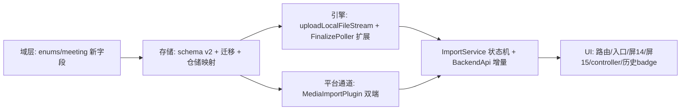
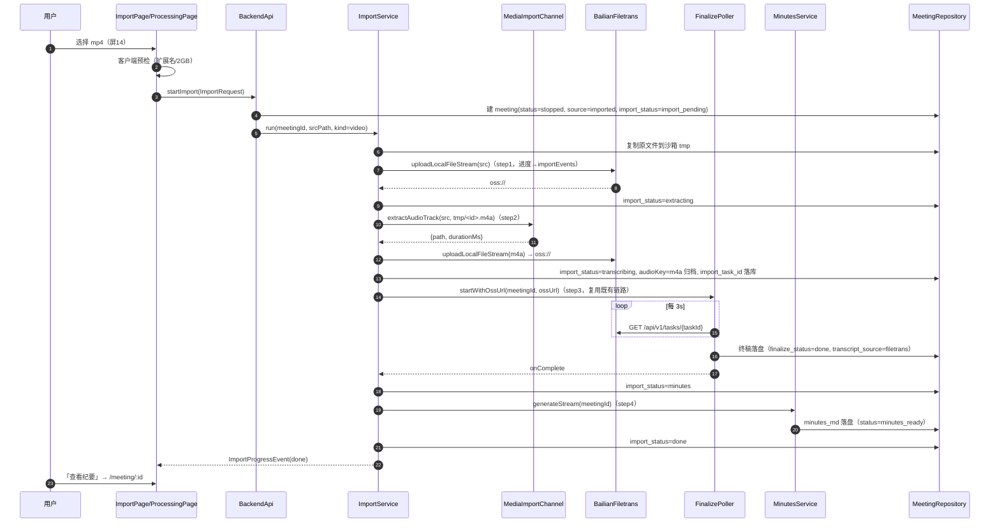
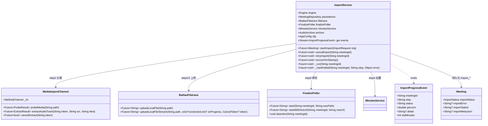

# 「导入音视频」增量设计文档 · 声羽 FeatherNote

> 文档版本：v1 · 撰写：架构师 高见远（Gao） · 日期：2026-10-08
> 基线项目：`smart-minutes-flutter`（Flutter 3.47.5 / Dart 3.13.4 / Riverpod 3 / go_router，Android + iOS）
> 性质：**增量设计**——只新增/最小化修改，不改动既有录音链路（`TranscriptionService` / `FinalizePoller` 语义保持不变）
> 状态机 SSOT：本文 §4；平台通道契约 SSOT：本文 §6

---

## 1. 已查证事实（百炼官方文档，附来源）

以下三条是本设计的地基，全部实查，**未查证前不下结论**：

### 1.1 支持的音频格式 —— m4a/aac **直接可用，无需 PCM 降级路径**

| 结论 | 内容 | 来源 |
| --- | --- | --- |
| filetrans 支持格式 | `aac, amr, avi, flac, flv, m4a, mkv, mov, mp3, mp4, mpeg, ogg, opus, wav, webm, wma, wmv` | [阿里云帮助中心·语音识别概述](https://help.aliyun.com/document_detail/3026929.html)、[模型 Studio·语音识别](https://help.aliyun.com/zh/model-studio/user-guide/speech-recognition-and-synthesis/) |
| 采样率 | 任意（服务端重采样为 16 kHz 再识别） | 同上 |
| 官方提示 | "Not all format variants are tested. Test your files to verify results."（格式变体未全部实测，需真机验证） | [Qwen Cloud·Filetrans SDK 文档](https://docs.qwencloud.com/api-reference/speech-recognition/fun-asr-recording/python-sdk) |

**设计影响（重要简化）**：本需求拍板的「原生通道分离音轨 → m4a」产物是 AAC-in-MP4（即 m4a），filetrans **直接支持**。原任务书中预备的「解封装后解码为 PCM→WAV」降级路径（Android `MediaCodec` / iOS `AVAudioConverter`）**不启用、不实现**。触发条件写死为：不存在——若未来 filetrans 收回对 m4a 的支持，才补该路径（列入 §9 风险监测）。

### 1.2 单文件上限（上传 URL 模式）

| 项 | 确切数值 | 来源 |
| --- | --- | --- |
| 单文件大小 | **≤ 2 GB** | [百炼·非实时语音识别](https://docs.bailian.console.aliyun.com/zh/model-studio/non-realtime-speech-recognition-user-guide)："Qwen-Audio-3.x-ASR-Flash-Filetrans / Fun-ASR / Qwen3-ASR-Flash-Filetrans / Paraformer：单个音频文件大小不超过 2GB，时长不超过 12 小时" |
| 单文件时长 | **≤ 12 小时** | 同上 |
| 说话人分离附加限制 | **启用 diarization 建议时长 ≤ 2 小时**，否则可能识别失败或超时 | 同上："启用说话人分离时：建议音频时长不超过 2 小时，否则可能导致识别失败或超时" |

本项目 filetrans 模型为 `qwen-audio-3.1-asr-flash-filetrans`（`AppConfig.filetransModel`），同属 Qwen-Audio-3.x-ASR-Flash-Filetrans 家族，适用上表。

### 1.3 上传方式与既有实现一致性（代码实读，非臆测）

既有链路（`lib/backend/engine/bailian/filetrans.dart`）：

```
getUploadPolicy()  GET /api/v1/uploads?action=getPolicy&model=...   → {upload_host, oss_access_key_id, signature, policy, upload_dir, ...}
uploadBuffer()     POST <upload_host>  (OSS 表单，字段顺序严格)        → oss://<upload_dir>/<filename>
submitFiletrans()  POST /api/v1/services/audio/asr/transcription
                   headers: X-DashScope-Async: enable + (oss:// 时) X-DashScope-OssResourceResolve: enable
```

与官方「上传 URL 模式（临时 OSS）」一致。**但存在一个必须修复的工程问题**：

> ⚠️ 既有 `uploadLocalFile()` 用 `file.readAsBytes()` 整读内存 + `MultipartFile.fromBytes(buffer)` 上传。录音 WAV（≤230MB）勉强可行，但**导入场景上限是 2GB，整读必然 OOM**。导入链路必须新增**流式上传**变体 `uploadLocalFileStream()`（`MultipartFile.fromFile`，dio 按块流式读文件），不动既有 `uploadBuffer`。

### 1.4 一条与需求叙事相关的官方事实（如实记录，不改变拍板）

官方 filetrans **直接支持 mp4/mov/mkv 等视频容器**——技术上「不分离直接传视频」也能转。**分离音轨是产品决策而非技术必需**（价值：上传体积小一个量级、转写更快、`diarization ≤ 2h` 按音轨时长计算）。本设计按拍板执行：视频一律先分离；此事实仅作为「分离失败时的降级备选」记录在 §9。

---

## 2. 需求 → 方案对照（已拍板决策逐条落地）

| # | 拍板决策 | 本设计的落地 |
| --- | --- | --- |
| 1 | 首页加入口，进入「导入音视频」页 | 首页待机屏（`home_idle_screen.dart`）新增入口卡片 → 路由 `/import` |
| 2 | 系统原生通道分离，不引 ffmpeg | Platform channel `feathernote/media_import`：Android `MediaExtractor`+`MediaMuxer`（demux 音轨→m4a，零解码零转码）；iOS `AVAssetExportSession(presetAppleM4A)`。冷门封装报「暂不支持，请转成 mp4 后重试」 |
| 3 | 单文件上限跟随官方 | **2GB / 12h**（§1.2）；客户端校验：大小精确校验 + 时长经 `probeMedia` 校验；diarization > 2h 时给提示但不阻断 |
| 4 | 转写完自动生成纪要 | 四步状态机第 4 步 `minutes`，复用 `MinutesService.generateStream`，沿用「一份纪要入库」数据统一约定（纪要必须来自 filetrans 终稿，不抢跑） |
| 5 | 进历史页，标题=文件名去扩展名，来源「导入」 | `MeetingSource.imported('imported')`；历史卡片新增「导入」badge；标题在建 meeting 时取文件名去扩展名 |

---

## 3. 总体架构与数据流

### 3.1 组件关系（新增件用 ★ 标注）

```
UI 层
  HomePage(入口卡片) ──go('/import')──▶ ImportPage(屏14 选择文件) ★
                                          │ file_picker 选文件 → 客户端预检(扩展名/大小)
                                          │ backendApi.startImport(...)
                                          ▼
                                       ImportProcessingPage(屏15 处理中) ★
                                          │ 订阅 backendApi.importEvents
                                          ▼
门面 BackendApi ★新增 startImport / cancelImport / retryImport / importEvents
                                          │
服务层 ImportService ★（四步状态机编排，纯 Dart 可单测）
   ├─ step1 上传     → BailianFiletrans.uploadLocalFileStream ★（流式，dio CancelToken）
   ├─ step2 分离     → MediaImportChannel ★（platform channel）
   ├─ step3 转写     → FinalizePoller（既有，零改动复用：提交→轮询→落盘→广播）
   └─ step4 纪要     → MinutesService（既有，零改动复用）
                                          │
存储层 MeetingRepository / AppDatabase ★（schema v1→v2：meetings 重建 + 新列）
```

**复用原则**：step3/step4 与录音链路**共用同一套** `FinalizePoller` + `MinutesService` + `MeetingRepository` 落库语义（先落盘后广播、`finalize_status` 状态机、空结果防误覆盖）。导入的会议在库中与录音会议**无结构差异**，仅 `source='imported'`、多一组 `import_*` 列。

### 3.2 为什么不复用 `startFinalize` 的「上传」段

`FinalizePoller.start(meetingId, wavPath)` 内部做「上传→提交→轮询」三合一路径：上传进度不可见（无 `onSendProgress`）、不可取消。导入需要一个**可见进度、可取消、分步状态**的编排层，所以新建 `ImportService` 负责 step1–2 与状态机，step3 之后把接力棒交回既有链路：

- `ImportService` 在 step3 开始时直接调用 `engine.submitFiletrans` + `finalizePoller.start()`？——**否**。`FinalizePoller.start` 会重新上传整份 WAV。正确做法：给 `FinalizePoller` 新增一个**入口方法** `startWithOssUrl(meetingId, ossUrl)`：跳过上传段，从「提交 filetrans」开始（提交/轮询/落盘/广播全部复用既有实现）。这是对 `finalize_poller.dart` 的**唯一改动**（约 20 行：把 `_run` 中的「上传」提为可选步骤）。

---

## 4. 四步状态机（SSOT）

### 4.1 状态定义（新枚举 `ImportStatus`，落库 `meetings.import_status`）

```
                 ┌─────────────┐
  选文件+预检通过 │import_pending│  step1 上传文件（含音频直传）
                 └──────┬──────┘
                        │ 上传完成
          ┌─────────────┴─────────────┐
          │ 是视频                      │ 是音频
          ▼                            │
   ┌─────────────┐                     │
   │ extracting   │ step2 分离音轨       │（自动跳过，UI 显示「无需分离」）
   └──────┬──────┘                     │
          │ m4a 归档完成                 │
          └─────────────┬──────────────┘
                        ▼
                 ┌─────────────┐
                 │ transcribing │ step3 语音转写（FinalizePoller）
                 └──────┬──────┘
                        │ 终稿落盘（transcript_source=filetrans）
                        ▼
                 ┌─────────────┐
                 │   minutes    │ step4 纪要生成（MinutesService）
                 └──────┬──────┘
                        │ minutes_md 落盘
                        ▼
                 ┌─────────────┐      任意一步失败/取消
                 │    done      │──────────────────────▶ failed（import_error 记录原因）
                 └─────────────┘
```

**与既有状态的关系（关键约定）**：

| 字段 | 导入过程中的取值 |
| --- | --- |
| `meetings.status` | 创建即 `stopped`（导入不是 recording）；step4 完成后由纪要落库置 `minutes_ready`（既有语义） |
| `meetings.source` | `imported` |
| `meetings.finalize_status` | step3 期间 `pending` → `done`/`failed`（由 FinalizePoller 维护，**与录音链路完全一致**） |
| `meetings.import_status` | 本文状态机；`failed` 时 `import_error` 记录「步骤名 + 原因」 |
| `meetings.audioKey` | step2 产出的 m4a 归档 key（`<meetingId>.m4a`）；音频直传场景=原文件归档 |
| `meetings.transcriptSource` | 终稿落盘后 `filetrans`（既有语义，导入无实时稿） |
| `meetings.durationMs` | step2 时 `probeMedia`/分离结果返回的真实时长；音频场景由 probe 提供 |

### 4.2 每步的详细语义

| 步骤 | 进入条件 | 动作 | 退出 → | 失败语义 |
| --- | --- | --- | --- | --- |
| ① `import_pending` | 用户在屏 14 选定文件并通过预检（§7），`startImport` 落库建 meeting | 1) 把原文件**复制**到沙箱临时目录 `<tmp>/smart-minutes-import/<meetingId><原扩展名>`（file_picker 可能给 cache 路径，复制避免中途被系统清理；原文件零修改）；2) 流式上传到临时 OSS | 视频→`extracting`；音频→直接 `transcribing` | 网络/超时 → `failed`，可**重试**（文件已在沙箱，免重选） |
| ② `extracting` | 输入是视频容器（mp4/mov/m4v） | `MediaImportChannel.extractAudioTrack(src, dest)` → 产 m4a → `archive.putFile` 归档 | → `transcribing` | `E_UNSUPPORTED_CONTAINER`/`E_NO_AUDIO_TRACK`/`E_EXTRACT_FAILED` → `failed`（前两者不可重试，报「暂不支持，请转成 mp4 后重试」） |
| ③ `transcribing` | m4a/音频文件已上传拿到 `oss://`，`import_task_id` 落库 | `FinalizePoller.startWithOssUrl(meetingId, ossUrl)`：提交 → 3s 轮询 → 下载 → 终稿落盘 | 终稿落盘成功 → `minutes`；失败 → `failed` | 沿用 `finalize_status=failed` + `finalizeError`（既有），同时镜像到 `import_status=failed` |
| ④ `minutes` | 终稿逐字稿已落库 | `MinutesService.generateStream(meetingId)`（不 force；错误不重试自动） | 成功 → `done`（status=minutes_ready）；失败 → `failed`（用户可走既有「重新生成」入口，重试后回到 `done` 判定） | `minutesError` 既有语义；`import_error` 同步记录 |

### 4.3 取消语义

- **取消 = 本地停止推进 + `import_status=failed`（`import_error='用户取消'`）**。
- 分步行为：
  - step1：`CancelToken.cancel()`（dio 原生中断上传）；
  - step2：`MediaImportChannel.cancelExtract(meetingId)`，原生侧置取消标志，导出回调抛 `E_CANCELLED`；
  - step3：**无百炼取消 API**（filetrans 是纯异步任务）。本地停止轮询（`FinalizePoller` 增加按 meetingId 的放弃入口 `abandon(meetingId)`，仅删内存态+落 failed），服务端任务自然跑完即作废，临时 OSS 对象 24h 过期。
  - step4：取消 SSE 流（既有 `generateStream` 取消语义）。
- 取消后清理：沙箱原文件与 m4a 中间产物保留（供「重试」），用户删除会议时统一清理（既有 `deleteMeeting` 级联）。

### 4.4 后台与「App 被杀」语义（明确设计，工程师无需追问）

| 场景 | 行为 |
| --- | --- |
| 用户点「后台处理」离开屏 15 | 处理**继续**（同进程 Dart 异步任务），历史页该卡片显示「导入处理中」badge；可从历史/首页重新进入屏 15 观察进度 |
| App 退到后台（未被杀） | Android：Dart isolate 继续运行，处理继续；iOS：进入挂起后网络任务暂停，回前台自动续跑（轮询/纪要幂等，可安全恢复）。**本版本不做后台长任务保活**（不引 BGTaskScheduler/前台服务 dataSync）——导入是用户主动短会话行为，接受挂起暂停 |
| App 进程被杀 → 冷启动 | `BackendApi.init()` 末尾执行 **`importService.recoverOnStartup()`**：<br>① `import_status ∈ {import_pending, extracting}` → **标记 failed**（`import_error='应用退出导致导入中断'`）。沙箱原文件若仍在，卡片提供「重试」按钮（从头跑，免重选文件）；<br>② `import_status = transcribing` 且 `import_task_id` 非空 → **恢复轮询**：直接 `engine.waitFiletrans(taskId)` + 既有落盘链路（不重新上传不重新提交，taskId 幂等）；<br>③ `import_status = minutes` → **重触发纪要**（`generateStream` 幂等）；<br>④ `done/failed/none` → 不动。 |

**为什么 pending/extracting 不做断点续传**：上传无分片断点（OSS 表单上传是单 POST），分离是进程内操作不可跨进程恢复；两者恢复成本 ≈ 重跑，且重跑路径与「重试」按钮完全同一条代码，不引入第二套恢复逻辑。

---

## 5. Meeting 模型与存储增量

### 5.1 枚举与模型改动

```dart
// lib/domain/enums.dart —— 增量
enum MeetingSource { microphone, upload, imported }   // 新增 imported('imported')

/// 导入处理状态机（落库 meetings.import_status）。
enum ImportStatus {
  none,           // 非导入会议（录音会议恒为 none）
  importPending,  // import_pending
  extracting,     // extracting
  transcribing,   // transcribing
  minutes,        // minutes
  done,           // done
  failed;         // failed
}

// lib/domain/meeting.dart —— Meeting 新增字段（copyWith 同步）
final ImportStatus importStatus;   // 默认 none
final String? importError;         // 失败/取消原因
final String? importTaskId;        // filetrans taskId（重启恢复轮询用）
final String? importMetaJson;      // JSON: {srcName, srcPath, kind: 'audio'|'video', sizeBytes, durationMs, extractedPath?}
```

`importMetaJson` 用 JSON 而非多列的理由：这些字段只服务于「导入详情展示 + 恢复判断」，不参与查询/排序；避免 meetings 列数膨胀。

### 5.2 SQLite 迁移（schema v1 → v2）

**难点**：既有 DDL 有 `CHECK (source IN ('microphone','upload'))`（`schema.dart:42`），SQLite **不能修改 CHECK 约束**，必须重建表（标准 12 步流程的简化版）：

```dart
// lib/backend/storage/app_database.dart —— onUpgrade (1→2)
// 1) PRAGMA foreign_keys=OFF
// 2) CREATE TABLE meetings_new (... 新 CHECK: source IN ('microphone','upload','imported') ... 新列 ...)
// 3) INSERT INTO meetings_new SELECT id,...,source,...（旧列）,'none',NULL,NULL,NULL（新列默认）FROM meetings
// 4) DROP TABLE meetings; ALTER TABLE meetings_new RENAME TO meetings;
// 5) 重建 meetings 相关索引；PRAGMA foreign_key_check; PRAGMA foreign_keys=ON
// 6) kSchemaVersion 常量 1→2，schema_meta 与 drift schemaVersion 双写同步
```

新增列（全部带默认值，对既有行零影响）：

| 列 | 类型 | 默认 | 约束 |
| --- | --- | --- | --- |
| `import_status` | TEXT | `'none'` | `CHECK (import_status IN ('none','import_pending','extracting','transcribing','minutes','done','failed'))` |
| `import_error` | TEXT | NULL | — |
| `import_task_id` | TEXT | NULL | — |
| `import_meta_json` | TEXT | NULL | — |

`MeetingRepository` 增量：`toRow`/`fromRow` 映射新列；`watchMeetings` 的 `MeetingSummary` 增加 `source` 与 `importStatus` 两个投影字段（历史卡片 badge 与「导入处理中」角标需要）。

### 5.3 数据统一约定核对表（沿用既有铁律）

| 约定 | 导入场景遵守方式 |
| --- | --- |
| 纪要必须来自 filetrans 终稿（不抢跑实时稿） | 导入无实时稿，step4 前置条件 = `finalize_status=done` 且 `segments` 非空（复用 `_persistDone` 空结果防误覆盖逻辑） |
| 先落盘后广播 | FinalizePoller / MinutesService 既有实现原样复用 |
| 一份纪要入库 | minutes_md / minutesPartial / minutesError 既有字段，零新增 |
| 时间戳毫秒、ISO 8601 UTC | probe 返回 durationMs；createdAt 沿用 `DateTime.now().toUtc()` |

---

## 6. Platform channel 设计

### 6.1 通道与签名

通道名：`feathernote/media_import`（StandardMethodCodec，JSON-safe 参数）

| Method | 参数 → 返回 | 双端实现 |
| --- | --- | --- |
| `probeMedia` | `{path}` → `{durationMs:int, hasAudio:bool, isVideoContainer:bool, mimeType:String}` | Android：`MediaExtractor.setDataSource` 遍历 track 判断 `MIME` 前缀（`audio/`/`video/`），`MediaFormat.KEY_DURATION`；iOS：`AVURLAsset.load(.duration, .tracks)` 遍历 `assetTracks` |
| `extractAudioTrack` | `{token:String, srcPath:String, destPath:String}` → `{path:String, durationMs:int, bytesWritten:int}` | 见 6.2 / 6.3。`token=meetingId`，用于取消 |
| `cancelExtract` | `{token:String}` → `{cancelled:bool}` | 双端查取消注册表，置标志 |

### 6.2 Android（`MediaImportPlugin.kt`，注册于 `MainActivity.kt`）

```
流程：MediaExtractor.setDataSource(src)
  → 找第一个 MIME 以 "audio/" 开头的 track（hasAudio=false → E_NO_AUDIO_TRACK）
  → MediaMuxer(dest, MPEG_4)；writeSampleData 逐 sample 拷贝音轨（不解码、零转码）
  → 输出 .m4a（AAC-in-MP4，采样率/声道原样保留）
取消：每 writeSampleData 前查取消标志 → 抛 E_CANCELLED（dest 删除）
错误：setDataSource 抛 IOException / 找不到可用音轨封装 → E_UNSUPPORTED_CONTAINER
```

注意：`MediaExtractor` 对 mp4/mov/3gp/m4a 原生可靠；mkv/avi/webm 即使部分机型能 demux，也**在 Dart 侧按扩展名白名单先行拦截**（§7），通道内只信白名单容器——双保险。

### 6.3 iOS（`MediaImportPlugin.swift`）

```
流程：AVURLAsset(url:) → load(.isExportable, .tracks)
  → 无音轨 → E_NO_AUDIO_TRACK
  → AVAssetExportSession(preset: AVAssetExportPresetAppleM4A)
     outputFileType = .m4a；export()（异步等待；被 cancel → E_CANCELLED）
  → 失败取 session.error 映射：兼容性/容器问题 → E_UNSUPPORTED_CONTAINER，其余 → E_EXTRACT_FAILED
```

`AVAssetExportSession(presetAppleM4A)` 只接受**音频源**，对视频容器会 export 失败——因此 iOS 上视频需先取音轨。标准做法：用 `AVAssetReader` 读音轨 PCM？——**否**，不引入解码。iOS 正确姿势：`AVAssetExportSession` + `presetAppleM4A` 直接作用于**音视频 asset** 时，部分系统版本可用（导出接口会自动只取音轨）；**实测不过时的兜底**：`AVAssetExportSession(preset: AVAssetExportPresetPassthrough)` 输出 `.mov` → 再对该 .mov 跑 `presetAppleM4A`（passthrough 只做容器转封装，不解码）。两段都零转码。此为 iOS 侧唯一实现细节风险，列入 §9 U3 需真机验证。

### 6.4 错误码映射表（原生 → Dart `AppError`）

| 原生 code | Dart `engineCode` | 用户文案（Toast/页面展示） | 可重试 |
| --- | --- | --- | --- |
| `E_UNSUPPORTED_CONTAINER` | 同名 | 暂不支持该视频格式，请转成 mp4 后重试 | 否（换文件） |
| `E_NO_AUDIO_TRACK` | 同名 | 该视频没有可用的音频轨道 | 否 |
| `E_CANCELLED` | 同名 | （用户取消，静默） | — |
| `E_SRC_UNREADABLE` | 同名 | 文件读取失败，可能已被移动或删除 | 否（重新选择） |
| `E_EXTRACT_FAILED` | 同名 | 音轨分离失败，请重试或转成 mp4 后重试 | 是 |
| Dart 侧 `E_TOO_LARGE` | 同名 | 单个文件需小于 2GB，当前文件 X.XGB | 否 |
| Dart 侧 `E_DURATION_LIMIT` | 同名 | 音频时长超过 12 小时上限 | 否 |
| 网络/HTTP（复用 `AppError.fromStatus`） | 既有 | 网络异常，请检查网络后重试 | 是 |

---

## 7. 文件大小 / 格式校验规则与文案（屏 14 预检）

**两道门**：屏 14 选择后立即做「客户端预检」（秒级、纯本地）；`probeMedia`（通道，毫秒级）在 `startImport` 内做第二道。

| 检查项 | 规则 | 失败文案 |
| --- | --- | --- |
| 扩展名白名单·音频 | `m4a aac mp3 wav flac ogg opus amr` | 「暂不支持该音频格式」 |
| 扩展名白名单·视频 | `mp4 mov m4v` | 「暂不支持，请转成 mp4 后重试」（mkv/avi/webm/wmv/flv 等一律在此拦截） |
| 大小 | ≤ 2GB（`cfg.importMaxMb = 2048`，读文件 `FileStat.size`） | 「单个文件需小于 2GB，当前文件 X.XGB」 |
| 无扩展名 | 按 URL mimeType 猜测；猜不出 → 拒绝 | 「无法识别的文件类型」 |
| 时长（probeMedia 后） | ≤ 12h 硬拦；> 2h 且 diarization=true 软提示（toast：「时长超过 2 小时，说话人分离可能失败或超时」，不阻断） | 「音频时长超过 12 小时上限」 |
| 音轨存在性 | `hasAudio=false` | 「该视频没有可用的音频轨道」 |

设计稿屏 14 的「单个文件 ≤ N」占位文案取 N=**2GB**。

**ETA 估算公式**（屏 15「预计还需约 X 分钟」）：

```
ETA(分钟) = ceil( 剩余上传MB / 假定带宽5MB/s / 60 ×1.5弱网系数 )
          + 视频时 ceil( 时长分钟 × 0.3 )          // 分离：demux 速度远快于实时，取 0.3× 冗余
          + ceil( 音轨时长分钟 × 0.25 ) + 1        // 转写经验系数 + 轮询间隔冗余
          + 1                                      // 纪要
分步完成后用已耗时效 Actual/Estimate 比例修正后续段。
```

---

## 8. UI 与路由

### 8.1 路由增量（`app_router.dart`）

| 路径 | 页面 | 形态 |
| --- | --- | --- |
| `/import` | `ImportPage`（屏 14：选择文件 + 最近导入） | 压栈页（`_pushPage`） |
| `/import/:id` | `ImportProcessingPage`（屏 15：四步处理中） | 压栈页；`extra` 可带首屏 `Meeting` |

- 「最近导入」列表：`watchMeetings()` 过滤 `source==imported`，复用 `HistoryCard`（新增「导入」badge）。
- 处理中页每步渲染四步卡（①上传 ②分离音轨/「无需分离」③语音转写 ④纪要），驱动源 = `importEvents` 流 + `meetings` 表 watch 双保险（事件丢失时以库为准）。
- 「后台处理」= 右上角按钮 = `context.pop()`（处理继续，同 §4.4 场景 1）；「取消处理」= 底部按钮 = 弹确认 → `cancelImport(meetingId)` → 落 `failed('用户取消')`。
- 屏 15 角标：「视频仅解析音轨，画面内容不参与分析」「原文件不会被修改」——**纯静态文案**，且与事实一致（分离只读源文件，产物写到新路径）。

### 8.2 入口（屏 01 首页待机态）

`home_idle_screen.dart` 待机卡片下方新增「导入音视频」入口（图标 + 文案「上传视频/音频，自动生成纪要」）→ `context.push('/import')`。录音中/生成中不显示入口（与「不允许再开一段」的既有守卫一致）。

### 8.3 Riverpod 控制器（新增 1 个，不与既有混用）

```dart
// lib/ui/providers/import_controller.dart
importEventsProvider        // StreamProvider：backendApi.importEvents → UI 增量
importProcessingProvider    // NotifierProvider<meetingId>：屏15 当前会议的步骤/百分比快照
                            //（每次 emit 新实例，规避 Riverpod 3 的 List/对象 == 过滤陷阱）
```

### 8.4 `BackendApi` 门面增量（`backend_api.dart`）

```dart
// abstract class BackendApi 新增：
Future<Meeting> startImport(ImportRequest req);        // 预检通过后调用；返回已建 meeting
Future<void> cancelImport(String meetingId);
Future<void> retryImport(String meetingId);            // failed → 从可续步骤重跑
Stream<ImportProgressEvent> get importEvents;          // {meetingId, step, status, percent, detail, etaMinutes}

// class ImportRequest { String srcPath; String srcName; bool isVideo; int sizeBytes; }
// class ImportProgressEvent { ... }（定义在 services/import_service.dart，门面 re-export）
```

`BackendApiImpl.init()` 末尾追加一行 `await importService.recoverOnStartup();`（§4.4）。

---

## 9. 文件清单（新增/修改，相对项目根）

### 新增（8 个）

| 文件 | 职责 |
| --- | --- |
| `lib/platform/media_import_channel.dart` | MethodChannel 封装：probe/extract/cancel + 错误码 → AppError 映射 |
| `android/app/src/main/kotlin/com/smartminutes/smart_minutes_flutter/MediaImportPlugin.kt` | MediaExtractor+MediaMuxer 实现；MainActivity.kt 注册（改 1 行） |
| `ios/Runner/MediaImportPlugin.swift` | AVAssetExportSession 实现；AppDelegate 注册（改 1 行） |
| `lib/backend/services/import_service.dart` | 四步状态机编排 + ImportProgressEvent + recoverOnStartup + ETA |
| `lib/ui/pages/import_page.dart` | 屏 14（状态→视图翻译，惯例与 home_page 一致） |
| `lib/ui/screens/import_idle_screen.dart` | 屏 14 视觉 |
| `lib/ui/screens/import_processing_screen.dart` | 屏 15 视觉（四步卡、进度、角标、取消/后台按钮） |
| `lib/ui/providers/import_controller.dart` | 两个 provider（§8.3） |

> `lib/ui/pages/import_processing_page.dart` 与 `import_page.dart` 合并为一个 page 文件（两个 screen 类同页切换），故 pages 只加 1 个文件。

### 修改（12 个）

| 文件 | 改动量级 | 内容 |
| --- | --- | --- |
| `lib/domain/enums.dart` | 小 | `MeetingSource.imported` + `ImportStatus` |
| `lib/domain/meeting.dart` | 小 | 4 个新字段 + copyWith |
| `lib/backend/storage/schema.dart` | 中 | meetings DDL 更新（CHECK+新列）、`kSchemaVersion=2` |
| `lib/backend/storage/app_database.dart` | 中 | onUpgrade 1→2 重建 meetings |
| `lib/backend/storage/tables/meetings.dart` | 小 | drift table 新列 |
| `lib/backend/storage/meeting_repository.dart` | 小 | 行映射 + MeetingSummary 投影 2 字段 |
| `lib/backend/engine/bailian/filetrans.dart` | 小 | 新增 `uploadLocalFileStream()`（流式，不动既有方法） |
| `lib/backend/services/finalize_poller.dart` | 小 | 新增 `startWithOssUrl()` + `abandon()`；`_run` 上传段提为可选 |
| `lib/backend/backend_api.dart` | 中 | 门面 4 个新方法 + init 恢复钩子 + 装配 ImportService |
| `lib/backend/di.dart` | 小 | 构造并注入 ImportService |
| `lib/core/config/app_config.dart` | 小 | `importMaxMb=2048`、`importMaxDurationHours=12`、`importDiarizationSoftLimitHours=2` |
| `lib/ui/router/app_router.dart` | 小 | 2 条路由 |

### 顺带修改（UI 接线，3 个）

`lib/ui/screens/home_idle_screen.dart`（入口）、`lib/ui/widgets/history_card.dart`（导入 badge + 处理中角标）、`pubspec.yaml`（新增 `file_picker`；版本以 `flutter pub add file_picker` 实际解析为准——**版本号不臆测**）。

### 依赖图



### 实现顺序任务列表（工程师可直接开工，无需追问）

| Task | 内容 | 涉及文件 | 依赖 | 验收 |
| --- | --- | --- | --- | --- |
| **T1** 域模型 + 存储迁移 | `ImportStatus`/`imported` 枚举、Meeting 新字段、schema v2 DDL + onUpgrade 重建 meetings、仓储映射、配置常量 | enums/meeting/schema/app_database/tables/meetings/meeting_repository/app_config | — | ① 升级安装（v1 库存量数据）后旧会议全量可读；② `PRAGMA table_info(meetings)` 含 4 新列；③ 插入 `source='imported'` 通过 CHECK；单测覆盖迁移 |
| **T2** 引擎扩展 + 平台通道 | `uploadLocalFileStream`（流式+进度回调+CancelToken）、`FinalizePoller.startWithOssUrl/abandon`、`MediaImportChannel` Dart 封装、Android/iOS 原生插件 + 注册 | filetrans/finalize_poller/media_import_channel/MediaImportPlugin.kt/MediaImportPlugin.swift/MainActivity.kt/AppDelegate.swift | T1 | ① 1.5GB 测试文件流式上传内存平稳（无 OOM）、进度回调线性；② 双端对 mp4/mov 样本分离出可播 m4a；③ mkv 样本返回 `E_UNSUPPORTED_CONTAINER`；④ 取消路径验证 |
| **T3** ImportService 状态机 + 门面 | 四步编排、ImportProgressEvent、取消/重试、recoverOnStartup、ETA、BackendApi 4 方法 + init 钩子、di 装配 | import_service/backend_api/di | T2 | ① 音频导入全链路（上传→转写→纪要→done，`source=imported`）；② 视频导入全链路含 extracting 步；③ 单测：状态机全转移表 + 恢复逻辑三分支（Mock 引擎） |
| **T4** UI 全量接线 | 路由 2 条、home 入口、屏 14/15（pages+screens）、import_controller、history badge、file_picker 接入 | router/import_page/import_idle_screen/import_processing_screen/import_controller/home_idle_screen/history_card/pubspec | T3 | ① 按屏 14/15 设计稿核对；② 音频导入②显示「无需分离」；③ 后台处理→历史 badge→重进进度正常；④ 取消确认弹窗→failed 文案；⑤ 录音链路回归不受影响 |
| **T5** 端到端联调 + 恢复语义验收 | 真机双端全场景：2GB 边界、12h 边界（构造元数据）、>2h diarization 软提示、杀进程恢复三分支、历史页展示 | — | T4 | §4.4 表格逐行复验通过；大文件（1–2GB）全程内存 < 300MB |

---

## 10. 风险与未决事项

| # | 风险/未决 | 影响 | 对策 |
| --- | --- | --- | --- |
| R1 | iOS `presetAppleM4A` 对视频 asset 的行为随系统版本有差异（§6.3） | extracting 在部分 iOS 版本失败 | passthrough→M4A 两段兜底已设计；T5 真机矩阵验证；再不过 → 记录到「暂不支持」，提示转 mp4 |
| R2 | 官方声明格式变体未全部实测（§1.1），m4a 内的 HE-AAC / 多声道变体可能识别异常 | 转写质量/失败 | filetrans 失败会走既有 failed 路径，文案引导重试；不做双引擎方案 |
| R3 | filetrans 直接支持 mp4（§1.4）——若「分离即失败率上升」实测成立 | 用户体验 | 降级备选已留：`extractAudioTrack` 失败且原文件在白名单容器时，可直接上传原视频（`startWithOssUrl` 支持任意格式）。**默认不启用**，待 T5 数据决定 |
| R4 | Android 大视频 `MediaMuxer` writeSampleData 在低端机耗时不可控 | extracting ETA 不准 | ETA 公式已含 0.3× 系数 + Actual 修正；进度百分比按 sample 计数输出 |
| R5 | file_picker 在 Android 沙盒/云文件（如「文件 App」云端项）返回路径不可读 | step1 复制失败 | 复制失败 → `E_SRC_UNREADABLE`，文案引导本地化后重选 |
| U1 | `file_picker` 与 Flutter 3.47 兼容性及权限清单改动（iOS 需 `NSDocumentsFolderUsageDescription`? 按包 README 核对） | 构建失败 | T4 首项验证 |
| U2 | 临时 OSS 上传凭证 policy 是否也受 2GB 单对象约束（官方未明说，推断 getPolicy 模式同限） | 恰好 2GB 文件 | 客户端按 <2GB 严格拦截，留 1MB 余量（`importMaxMb=2047`? —— 采用 2048，边界文件由 OSS 侧报错兜底，文案映射网络异常） |
| U3 | iOS passthrough 兜底未实测（R1） | 见 R1 | T5 |
| Q1 | 「最近导入」列表条数上限与分页 | 屏 14 信息密度 | 默认最近 5 条，超出「查看全部」跳历史页筛选 `source=imported`（筛选器为 P2，先不做） |

---

## 附录 A：导入全链路时序图（视频）



## 附录 B：核心类图


